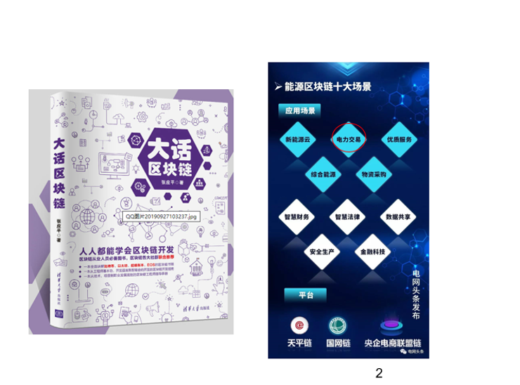

# enterprise_blockchain_tutorial
> 企业级区块链实战课程

作者：张应平

## 作者简介

纸贵科技技术顾问  
曾任陕西省数字证书认证中心 副总经理  
曾主导电网企业综合实验平台、一证通公共服务平台、电子政务统一平台等大型国家级项目  
从事信息化及密码产品技术研发16年  
近5年主攻大数据、物联网、区块链领域，擅长系统设计、产品研发  
2019年参与国家电网区块链一系列方案的编写及国家电网“综合能源交易”试点项目策划及实施，该项目作为国网第一个区块链项目目前已上线试运行。  
著有[大话区块链](https://item.jd.com/12719282.html)（2019年11月由清华大学出版社出版）《走进区块链》（网络版）  

## 为什么要写这个教程

去年春节期间，我将自己关在家里，完成了《大话区块链》的初稿编写。十一长假结束后这本书正式上线京东，由于运气比较好，上线京东一个月，首印3000册就卖光了。  

2020年本来没打算再写书籍、教程，因为之前已经谈了几个项目，年后准备落地，但由于疫情目前这些项目都暂时搁置。百无聊赖之际，与其天天刷各种消息搞的心惊胆战的，还不如干一件有意义的事情，所以在春节期间，我就开始了《企业级区块链实战课程》编写。

该区块链实战课是目前市面最具实战精神的课程，吸取了《大话区块链》这本书的精华以及我之前在国家电网实施的项目经验。  

## 课程简介

中共中央政治局2019年10月24日下午就区块链技术发展现状和趋势进行第十八次集体学习。中共中央总书记习近平在主持学习时强调，区块链技术的集成应用在新的技术革新和产业变革中起着重要作用。我们要把区块链作为核心技术自主创新的重要突破口，明确主攻方向，加大投入力度，着力攻克一批关键核心技术，加快推动区块链技术和产业创新发展。 

2020年政府、企业将会大规模进军区块链行业，区块链技术已经从数字货币开始延伸到数字金融、物联网、智能制造、供应链管理、数字资产交易等多个领域。相对公链，联盟链在我国具有得天独厚的发展优势。  

超级账本（ Hyperledger ）项目是首个面向企业应用场景的开源分布式账本平台，由Linux基金会主管，领导者囊括了金融、银行、物联网、供应链、制造行业和技术领域的佼佼者，目前成员已增长到275+多个，国际上有我们熟悉的埃森哲、IBM、英特尔、摩根大通、花旗集团、德国电信、微软等巨头，国内熟悉的有蚂蚁金服、百度、小米、招商银行、趣链科技、联想、纸贵科技等区块链企业。  

Hyperledger Fabric是目前超级账本项目中发展最好的子项目，作为最早加入超级账本项目的顶级项目，Fabric 由IBM 、DAH 等企业于2015年底提交到社区。该项目的定位是面向企业的分布式账本平台，创新地引入了权限管理机制，设计上支持可插拔、可扩展，是首个面向联盟链场景的开源项目。作为联盟链最重要的代表，Hyperledger Fabric具有良好的设计架构、完善的文档、清晰的代码，是企业研发和实施区块链的首选。  

本课程从区块链的技术思想、技术理论和项目实战三个维度详细介绍Hyperledger Fabric，让大家快速理解区块链技术，进而解决政府、企业面临的诸多业务困境。  

技术思想方面会从区块链学习、区块链技术理论、区块链开发和项目实战等方面讲解大家应该掌握的套路，从认知角度让大家看懂本课程中涉及的知识难点，带领大家快速进入学习状态。  

技术理论方面详细讲解了区块链核心概念、基本原理、应用原则以及Hyperledger Fabric的系统架构、交易流程和隐私安全等，通过学习每个学员都能全面理解区块链技术的实现原理及商业价值。  

项目实战方面以实际项目案例为背景，从需求分析、环境搭建、智能合约开发到应用开发全面讲解企业实施区块链所需技能，通过学习每个学员都可以掌握区块链开发，具备区块链项目实施的能力。  

## 目标人群

有2年左右程序开发经验，无需任何区块链开发经验，适合区块链开发人员、区块链架构师以及区块链技术爱好者。

## 课程内容

1. 区块链技术理论
* 区块链核心概念
* 区块链的分类
* 学习区块链的正确姿势
* 区块链技术原理
* 区块链应用原则
* 区块链实施原则
* 拓展阅读

2. 区块链开发实战预备知识
* 区块链很难学吗？
* 区块链开发应该具备的能力
* 区块链编程需要注意的问题
* 区块链开发工程师岗位技能要求
* 区块链技术选型

3. Hyperledger Fabric 架构详解
* Hyperledger 项目简介
* Hyperledger Fabric网络体验
* Hyperledger Fabric系统架构
* Hyperledger Fabric核心组件
* Hyperledger Fabric典型交易流程
* 拓展阅读

4. Fabric网络搭建详解
* 网络概况（5 Orderer +4 Peer+1 CLI）
* 生成证书文件
* 生成交易相关文件
* 启动网络节点
* 网络配置
* 网络测试
* 扩展阅读

5. 智能合约开发
* 开发环境
* Golang核心知识
* 链码基本概念
* 链码开发
* 单元测试
* Fabric开发环境测试
* 扩展阅读

6. 区块链溯源案例分析
* 区块链农产品溯源方案设计
* 需求分析
* 数据资产及业务流程设计
* 智能合约设计开发
* Fabric SDK
* 区块链应用开发
* 生产环境最佳实践

7. 区块链即服务
* BaaS（Blockchain as a service）简介
* IBM Bluemix区块链平台
* 阿里云区块链平台
* 使用Cello搭建区块链平台
* 扩展阅读

8. 区块链技术发展趋势
* 区块链技术融合（大数据、人工智能、物联网）
* 区块链技术面临的主要挑战
* 区块链技术发展趋势

9. 课程总结
* 重点知识串讲
* 后续学习建议

