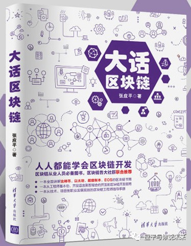
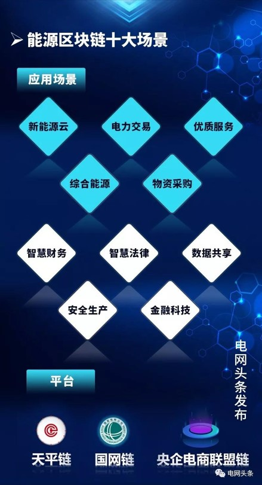
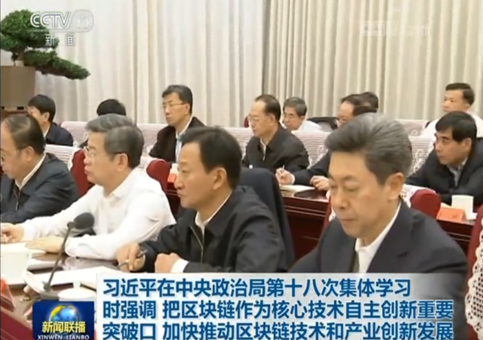
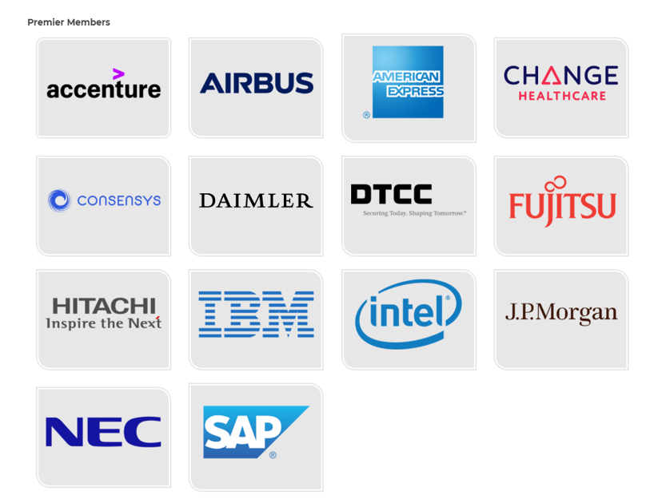
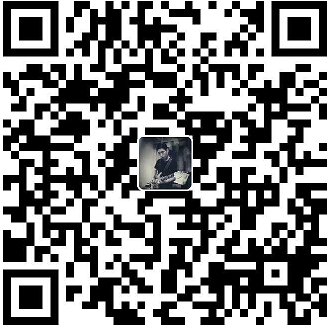

# enterprise_blockchain_tutorial

> 企业级区块链实战教程

* 目前市面上最具实战精神的区块链教程
* 从技术思想、技术理论和项目实战多维度讲解区块链
* 从需求、智能合约到应用全面讲解区块链实施技能
  

## 作者简介
**张应平**

* 曾主导[电网企业综合实验平台](https://www.ixueshu.com/document/cd7838079876fcadc84d23b8ec161b67318947a18e7f9386.html)、一证通公共服务平台、电子政务统一平台等大型国家级项目  
* 从事信息化及密码产品技术研发16+年  
* 近5年主攻大数据、物联网、区块链领域，擅长系统设计、产品研发  
* 2019年参与国家电网区块链一系列方案的编写及国家电网[综合能源交易](https://www.sohu.com/a/364826594_505899)试点项目策划及实施，该项目作为国网第一个区块链项目目前已上线试运行。  
* 著有[《大话区块链》](https://item.jd.com/12719282.html)（2019年11月由清华大学出版社出版）《走进区块链》（网络版） 
* 公众号《应平与你说未来》 

 

0-0 《应平与说未来》

 

0-1 《大话区块链》

 

0-2 基于区块链的电力交易

## 课程简介

中共中央政治局2019年10月24日下午就区块链技术发展现状和趋势进行[第十八次集体学习](http://www.gov.cn/xinwen/2019-10/25/content_5444957.htm)。中共中央总书记习近平在主持学习时强调，区块链技术的集成应用在新的技术革新和产业变革中起着重要作用。我们要把区块链作为核心技术自主创新的重要突破口，明确主攻方向，加大投入力度，着力攻克一批关键核心技术，加快推动区块链技术和产业创新发展。 

0-3 第十八次集体学习

2020年政府、企业将会大规模进军区块链行业，区块链技术已经从数字货币开始延伸到数字金融、物联网、智能制造、供应链管理、数字资产交易等多个领域。相对公链，联盟链在我国具有得天独厚的发展优势。  

超级账本（Hyperledger）项目是首个面向企业应用场景的开源分布式账本平台，由Linux基金会主管，领导者囊括了金融、银行、物联网、供应链、制造行业和技术领域的佼佼者，目前成员已增长到275+多个，国际上有我们熟悉的埃森哲、IBM、英特尔、摩根大通、花旗集团、德国电信、微软等巨头，国内熟悉的有蚂蚁金服、百度、小米、招商银行、趣链科技、联想、纸贵科技等区块链企业。  

0-4 超级账本部分成员

Hyperledger Fabric是目前超级账本项目中发展最好的子项目，作为最早加入超级账本项目的顶级项目，Fabric 由IBM 、DAH 等企业于2015年底提交到社区。该项目的定位是面向企业的分布式账本平台，创新地引入了权限管理机制，设计上支持可插拔、可扩展，是首个面向联盟链场景的开源项目。作为联盟链最重要的代表，Hyperledger Fabric具有良好的设计架构、完善的文档、清晰的代码，是企业研发和实施区块链的首选。  

本课程从区块链的技术思想、技术理论和项目实战三个维度详细介绍Hyperledger Fabric，让大家快速理解区块链技术，进而解决政府、企业面临的诸多业务困境。  

技术思想方面会从区块链学习、区块链技术理论、区块链开发和项目实战等方面讲解大家应该掌握的套路，从认知角度让大家看懂本课程中涉及的知识难点，带领大家快速进入学习状态。  

技术理论方面详细讲解了区块链核心概念、基本原理、应用原则以及Hyperledger Fabric的系统架构、交易流程和隐私安全等，通过学习每个学员都能全面理解区块链技术的实现原理及商业价值。  

项目实战方面以实际项目案例为背景，从需求分析、环境搭建、智能合约开发到应用开发全面讲解企业实施区块链所需技能，通过学习每个学员都可以掌握区块链开发，具备区块链项目实施的能力。  

## 目标人群

有2年左右程序开发经验，对区块链有一定的了解，适合区块链开发人员、区块链架构师以及区块链技术爱好者。

## 预备知识
* 理解区块链基本概念
* 熟悉Linux基本命令
* 熟悉Docker常用命令
* 熟悉Git基本命令
* 有两年左右编程经验

## 课程内容

**1. 区块链技术理论**
* [区块链核心概念](./chapter1_01%20blockchain_core_concept.md)
* [区块链的分类](./chapter1_02%20types_%20of_blockchains.md)
* [学习区块链的正确姿势](./chapter1_03%20correct_method_of_learn_blockchain.md)
* [区块链技术原理](./chapter1_04%20how_does_blockchain_work.md)
* [区块链的应用原则](./chapter1_05%20blockchain_application_principle.md)
* [区块链实施原则](./chapter1_06%20blockchain_project_execution.md)
* [区块链技术理论总结](./chapter1_07%20summary.md)

**2. 区块链开发实战预备知识**
* [区块链很难学吗？](./chapter2_01%20misunderstands_of_blockchain.md)
* [区块链开发应该具备的能力](./chapter2_02%20the_ability_of_dev.md)
* [区块链编程需要注意的问题](./chapter2_03%20three_questions_of_dev.md)
* [区块链开发工程师岗位技能要求](./chapter2_04%20blockchain_engineer_skills.md)
* [区块技术选型](./chapter2_05%20selection_of_technology.md)
* [区块链开发实战预备知识总结](./chapter2_06%20summary.md)

**3. Hyperledger Fabric 架构详解**
* [Hperledger 项目简介](./chapter3_01%20hyperledger_project_overview.md)
* [Hyperledger Fabric 网络体验——系统环境配置](./chapter3_02_part1%20hyperledger_fabric_network_prerequisites.md)
* [Hyperledger Fabric 网络体验——Fabric网络环境](./chapter3_02_part2%20hyperledger_fabric_network_installing.md)
* [Hyperledger Fabric 网络体验——网络启动过程概览](./chapter3_02_part3%20hyperledger_fabric_network_bring_up.md)
* [Hyperledger Fabric 系统架构](./chapter3_03%20hyperledger_fabric_architecture.md)
* [Hyperledger Fabric 核心组件](./chapter3_04%20hyperledger_fabric_core_components.md)
* [Hyperledger Fabric 典型交易流程](./chapter3_05%20hyperledger_fabric_workflow_of_transaction.md)
* [Hyperledger Fabric 架构详解知识总结](./chapter3_06%20summary.md)

**4. Fabric网络搭建详解**
* [网络概况5 Orderer +4 Peer+1 CLI](./chapter4_01%20fabric_network_overview.md)
* [生成证书文件](./chapter4_02%20generate_certificate.md)
* [生成交易相关文件](./chapter4_03%20configuration_transaction.md)
* [启动网络节点](./chapter4_04%20bring_up_network.md)
* [网络配置](./chapter4_05%20create_join_channel.md)
* [网络测试](./chapter4_06%20test_fabric_network.md)
* [网络搭建详解知识总结](./chapter4_07_summary.md)

**5. 智能合约开发**
* [开发环境](./chapter5_01%20smartcontract_dev_env.md)
* [Golang核心知识](./chapter5_02_part1%20golang_core.md)
* [Golang核心知识——数据类型](./chapter5_02_part2%20golang_core.md)
* [Golang核心知识——函数、流程控制及方法](./chapter5_02_part3%20golang_core.md)
* [Golang核心知识——指针接收器及接口](./chapter5_02_part4%20golang_core.md)
* [链码基本概念](./chapter5_03%20chaincode_concept.md)
* [链码开发](./chapter5_04%20chaincode_dev.md)
* [单元测试](./chapter5_05%20chaincode_unit_test.md)
* [智能合约开发知识总结](./chapter5_06%20summary.md)

**6. 区块链溯源案例分析**
* [区块链农产品溯源方案设计](./chapter6_01%20solution.md)
* [需求分析](./chapter6_02%20requirement.md)
* [数据资产及业务流程设计](./chapter6_03%20asset_business_design.md)
* [智能合约设计开发](./chapter6_04%20smartcontract_dev.md)
* [Fabric SDK](./chapter6_05%20fabric_sdk.md)
* [区块链应用开发](./chapter6_06%20blockchain_application_dev.md)
* [区块链溯源案例分析知识总结](./chapter6_07%20summary.md)

**7. 区块链即服务**
* [IBM Bluemix 区块链平台](./chapter7_01%20ibm_bluemix_baas.md)
* [阿里云区块链平台](./chapter7_02%20aliyun_baas.md)
* [使用Cello搭建区块链平台](./chapter7_03%20cello.md)
* [区块链即服务知识总结](./chapter7_04%20summary.md)

**8. 区块链技术发展趋势**
* [区块链技术融合（大数据、人工智能、物联网）](./chapter8_01%20blockchain_technology_integration.md)
* [区块链技术面临的主要挑战](./chapter8_02%20blockchain_technology_challenges.md)
* [区块链技术发展趋势](./chapter8_03%20blockchain_technology_trend.md)
* [区块链技术发展趋势总结](./chapter8_04%20summary.md)

**9. 课程总结**
* [重点知识串讲](./chapter9_00.md)
* [后续学习建议](./chapter9_00.md#后续学习建议)

## 参考资料

1. 张应平，[《大话区块链》](https://item.jd.com/12719282.html)，清华大学出版社，2019年.
2. [Fabric官方文档](https://hyperledger-fabric.readthedocs.io/en/release-1.4)
   
**如果您觉着本教程写的不错，欢迎打赏、点赞、转发，您的支持是我做免费区块链教程的动力。**

  
微信收款码

  
支付宝收款码

