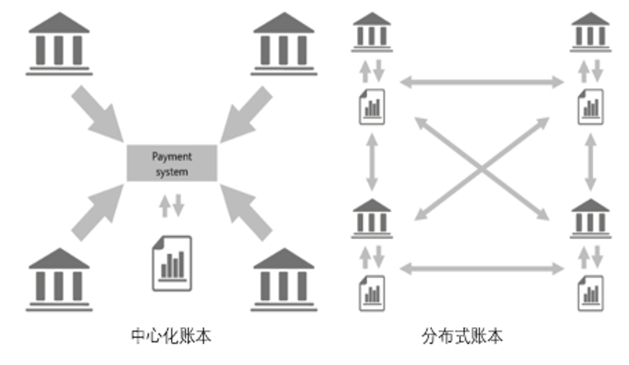

## 区块链核心概念

我经常会被人问到这样一句话，张老师您能不用一句话给我解释一下什么是区块链？

我想来想去如果只讲一句话，那就是**区块链是一种分布式账本技术**。这个账本与我们之前使用的账本不一样，由于它是一群人来记账，所以修改这个账本的难度就比较高。

 
1-01 分布式记账

整个人类文明发展都是伴随着记账技术的不断演化，经历了从原始的单式记账、复式记账、现在的数字化记账到以区块链为代表的分布式记账。

传统的中心化数字记账都依赖于某一个组织（比如阿里）的可信度，以及这个组织背后的技术是否过硬，管理是否足够严格，等等。

而区块链则不同，它是通过共识机制发动节点来共同记账，在区块链技术中，要修改数据一般要得到半数左右节点的同意才可以修改（不同共识机制的策略会有所不同）。相对于传统中心化单个节点说了算的记账技术，采用区块链记账可以提高大家的信任程度，而这种信任机制的建立不依赖于某个组织、某个人，是由区块链技术来保障的。

区块链确定性是由密码学保障的，密码学是由数学保障的，而数学是这个宇宙唯一确定的学科。如果这个世界上外星文明，唯一可以让人类与外星文明进行沟通的就是数学。在地球上1+1=2，在其他星球上1+1也只能等于2。区块链技术的确定性是由数学来保障的。

区块链记账具有去中心化、难以篡改、可追溯等特点。

去中心化的英文是decentralized，原意是：
>* transfer (authority) from central to local government.
>* move departments of (a large organization) away from a single administrative centre to other locations.

根据英文原意，将去中心化理解为多中心化更为合适。

难以篡改是区块链的主要特性。传统数据库包含了增删改查（CURD），而区块链只有增加和查询，不能修改、不能删除。因此，区块链也是一种“历史记录不可篡改的数据库”。相对传统中心化系统，区块链是一种确定性系统。

可追溯性是基于数据结构和时间戳来保证的。

具体技术细节我会在技术原理部分进一步阐述，或者在京东上购买我的新书[《大话区块链》](https://item.jd.com/12719282.html)，第一章节和第三章节都有详细的介绍。
