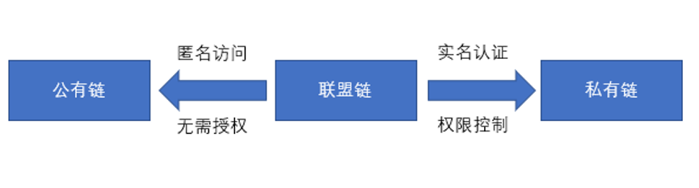

## 区块链的分类

区块链分为公有链、联盟链、私有链三种。

相对来说，越靠近公有链，对节点的认证和权限管理要求越少，去中心化程度越高。越靠近私有链，对节点的认证和授权管理程度越高，中心化程度越高。

 

1-02 区块链的分类

**公有链**是最具区块链精神的。在公有链上，任何人都可以作为区块链的节点，节点通常具有匿名性，一般会通过发币鼓励参与者记账。

公有链主流的共识机制有工作量证明机制（Proof of Work，PoW）、权益证明机制（Proof of Stake，PoS）和代理权益证明机制（Delegate Proof of Stake，DPoS）。这些共识机制往往都融合了经济学———工作量证明机制锚定的是算力，权益证明机制和代理权益证明机制锚定的是权益（token）。

共识机制的核心是记账权的争夺，公有链的设计思路是让恶意节点的攻击成本远远大于诚实节点的受益，基于利益的考虑，大家与其作恶白白损失金钱还不如老老实实记账。

典型公有链有比特币、以太坊、EOS等，都是在特定时期解决了不同的问题。比特币是世界上第一个成功的去中心化数字货币系统；以太坊在比特币基础上提出了一种可编程、可运算的智能合约公有链；EOS提出了超越货币、经济的去中心化应用操作系统。

相对公有链的开放性，**联盟链**节点需要经过认证才能参与到区块链网络中。由于联盟链节点数有限，因此联盟链的交易速度更快，具有更高的扩展性，并能很好的保护交易隐私。

公有链在共识机制的选择上一般都会采用拜占庭容错机制，拜占庭机制解决了节点故障和节点作恶（伪造数据）情况下，系统都能够达成共识。由于联盟链节点数有限且需要认证，为了提高效率，因此大部分联盟链在共识机制上弱化了节点作恶，重点考虑系统1/3节点故障下系统共识机制的达成。

联盟链主要应用在政府、企业级应用中，一般不需要代币作为激励机制。比如政府部门之间和企业之间的业务，通过区块链技术为各部门之间建立一个共享账本，可以大幅度提升部门之间的工作效率。在这种情况下，每个部门作为记账节点出现，其实激励已经演变成为跨部门之间业务协同给大家带来的经济效益。

2019年10月24日中共中央政治局集体学习区块链之后，国家开始大力鼓励发展区块链技术。相对于公链，联盟链在我国具有得天独厚的发展优势。  

联盟链的代表是超级账本（ Hyperledger ）。超级账本（ Hyperledger ）项目是首个面向企业应用场景的开源分布式账本平台，由Linux基金会主管，领导者囊括了金融、银行、物联网、供应链、制造行业和技术领域的佼佼者，目前成员已增长到275+多个，国际上有我们熟悉的埃森哲、IBM、英特尔、摩根大通、花旗集团、德国电信、微软等巨头，国内熟悉的有蚂蚁金服、百度、小米、招商银行、趣链科技、联想、纸贵科技等区块链企业。  

Hyperledger Fabric是目前超级账本项目中发展最好的子项目，作为最早加入超级账本项目的顶级项目，Fabric 由IBM 、DAH 等企业于2015年底提交到社区。该项目的定位是面向企业的分布式账本平台，创新地引入了权限管理机制，设计上支持可插拔、可扩展，是首个面向联盟链场景的开源项目。作为联盟链最重要的代表，Hyperledger Fabric具有良好的设计架构、完善的文档、清晰的代码，是企业研发和实施区块链的首选。  

**私有链**是在某一领域、某一企业运行的区块链。相对公有链、联盟链，私有链相对比较封闭。在一个组织机构比较复杂的企业里，将各个部门作为节点出现，可以解决部门间的信任问题。

从区块链信任的特点来看，区块链会在公有链和联盟链得到长足发展。从长远来看，公有链和联盟链在技术上会趋向融合，界限也会越来越模糊。一般是将需要信任的数据放在公有链上，而一些行业数据、私有数据放在联盟链上。
