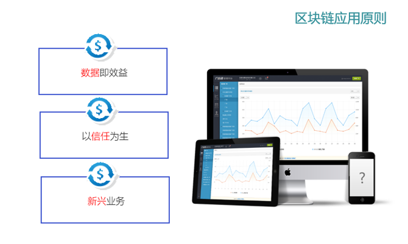

## 区块链应用原则

理解了区块链的技术原理，下面我们看看区块链技术是怎样应用到金融、数据共享、商品溯源、数据资产化等领域。

我在[《大话区块链》](https://item.jd.com/12719282.html)一书中对区块链应用给出了如下应用原则：

 

1-05 区块链应用原则

下面来简要的解释一下：

###  数据即效益

区块链第一个作用是可以在保证数据所有权的情况下实现数据共享。

由于区块链技术可以保证数据所有权，因此可以将区块链应用在存证、数字版权、数据共享和数据资产化等应用场景。

存证和数据共享是区块链现阶段可以落地的应用场景，数据资产化将会是区块链技术未来一个大的发展趋势。

###  以信任为生

区块链第二个作用是可以实现跨机构、跨组织、跨部门协作。

金融机构做的就是信任中介的生意，比特币就是为了建立一个全球银行而生，金融行业是最早研究区块链的机构。

区块链在金融行业应用该可以分为两个方向，第一个是金融业务协作平台，比如供应链金融、资产证券化（ABS）、保险理赔等，区块链主要作用是解决多方协作的效率低、成本高、信息透明度低、监管不透明等问题；第二方向是金融基础设施，主要集中在支付和数字货币，但这个领域是一个非常复杂的系统工程，需要自上而下逐步推进。

除了金融，供应链管理、智能制造、医疗、商品溯源、精准扶贫这些领域都是区块链技术比较好的应用场景。

另外，我认为公共行业（投票、选举、公益、社交等公共活动）将是区块链的一个主战场。

为什么这么讲？原因是公共行业缺乏成熟的商业模式，政府和企业都非常无助，区块链可以用较低的成本将社会成员组织起来，让公共行业变得更加高效、可持续。

以今年爆发的疫情为例。新型冠状病毒疫情爆发之后，武汉及周边各市县均爆出物资供给不足的情况。重大公共卫生事件在公共社会事件中属于较复杂的类型，统筹安排难度大，周期长，各供需方对接效率低下，而目前信息采集与公布平台不一致，信息散乱很难进行有效沟通。如果我们采用区块链搭建一个公共卫生平台，让供需方进行分布式对接则可以大幅度提升效率。

###  新兴业务

互联网和企业信息化近10年的快速发展，得益于云计算这种中心化技术的成熟，但中心化架构除了自身的缺陷之外，在面对一些新业务明显能力不足。当中心化业务走到尽头，许多新兴业务在不远的将来将会成为社会的主流。

不管是数据共享，还是信任重构都是使用区块链解决现有业务痛点，属于降维打击——是使用区块链技术解决传统业务的痛点。

但类似物联网、分布式能源等业务都属于新兴业务，传统中心化架构根本无法应对。如何将区块链技术应用在这些业务场景中是区块链技术未来的发展趋势，但受制于业务和技术的不成熟这些领域的到来还需时间。