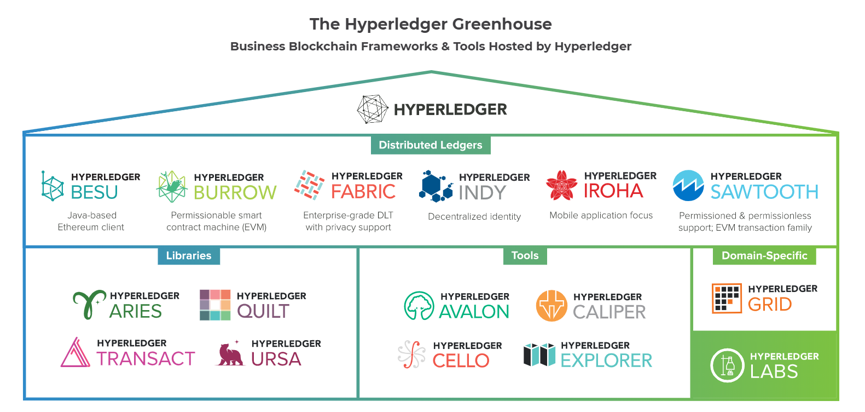
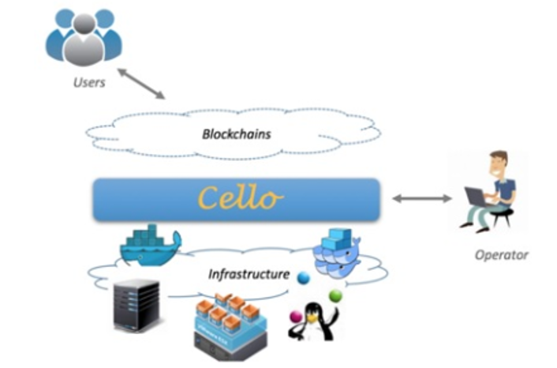

## Hperledger 项目简介

超级账本是一组专注于跨行业分布式账本技术的开源项目，其主要目标是创建企业级、开源、分布式的分类框架和代码库来支持业务用例。

超级账本的关键目标之一不只是建立自己的分布式账本技术，更重要的是建立分布式账本技术的行业标准，鼓励更多企业参与到分布账本技术的建设和应用中来，形成一个开放的生态体系。

过去几年里，超级账本的发展速度非常快，截至2020年1月，超级账本由15个项目组成,其中6个是超级账本的框架（Hyperledger Frameworks），9个项目是支持这些框架的工具（Hyperledger Tools），这些项目的代码都开源在github上。

 

3-01-01 超级账本项目

超级账本项目官方文档地址：https://www.hyperledger.org/projects

超级账本项目代码地址：https://github.com/hyperledger

1. 超级账本框架

* **Hyperledger Fabric**是最早加入超级账本项目的顶级项目，Fabric 由IBM 、DAH 等企业于2015年底提交到社区。该项目的定位是面向企业的分布式账本平台，创新地引入了权限管理机制，设计上支持可插拔、可扩展，是首个面向联盟链场景的开源项目。

* **Hyperledger Iroha**是由Soramitsu、日立、NTT Data和Colu提供。超级账本Iroha可以非常方便地集成到需要分布式账本技术的基础设施项目中。有别于其它超级账本框架，超级账本Iroha支持Android和iOS客户端库的移动应用程序开发。超级账本Iroha支持C++语言进行开发，采用了YAC共识机制。

* **Hyperledger Sawtooth**是由Intel提供的一个区块链框架，它利用模块化平台构建、部署和运行分布式账本，支持物联网（IoT）芯片的接入。超级账本Sawtooth根据网络情况使用了动态共识算法——运行时间证明机制（Proof of Elapsed Time，PoET），该算法提供了较好的可扩展性，同时又不需要很高的能耗。PoET支持高度可伸缩的验证器节点网络。部署方式上Hyperledger Sawtooth支持公有链和联盟链两种方式。

* **Hyperledger Indy**是为身份认证设计的一种分布式账本技术，可以很好地保护用户隐私。Hyperledger Indy的目标是通过开发一组分散的身份规范和组件，这些规范和组件独立于任何特定的分布式账本，并将支持分布式账本之间的操作。

* **Hyperledger Burrow**的正式名称是iris-db，于2014年12月发布。Hyperledger Burrow是一款可授权的智能合约应用引擎，提供以太坊虚拟机的支持。

2. 超级账本工具

超级账本框架是用来构建区块链和分布式账本。超级账本工具是区块链的辅助软件，用于部署和维护区块链网络，检查账本数据以及区块链的设计和开发。这里重点介绍一下cello和explorer。

* Hyperledger Cello

Cello（/ˈtʃɛləʊ/）英文是大提琴的意思，通过Cello可以非常方便地创建、管理区块链服务，降低超级账本框架部署、维护的复杂度。

Hyperledger Cello用来搭建区块链即服务(Block-as-a-Service,BaaS)平台。特别是对于想要降低区块链实施难度的中小型企业，Hyperledger Cello允许将区块链部署到云端。操作人员可以通过仪表盘创建和管理区块链，技术人员也可以非常方便地创建区块链实例。

作为超级账本模块，Cello的目标是将随需应变的“软件即服务（SaaS, Software as a service）”部署模型引入到区块链生态系统，从而帮助企业进一步开发和部署超级账本框架。Hyperledger Cello最初由IBM提供，赞助商包括Soramitsu、华为和英特尔。下图是超级账本Cello的操作示意图。

 

3-01-02 超级账本Cello的操作示意图

* Hyperledger Explorer
  
Hyperledger Explorer是一种可视化区块链操作工具，是首个超级账本区块链浏览器，由DTCC、英特尔和IBM提供。

Hyperledger Explorer旨在创建用户友好的Web应用程序，用户可以查看、调用、部署或查询区块,交易和交易相关数据,网络信息（名称、状态、节点列表）,智能合约（智能合约代码和交易）,存储在账本中的其它相关信息。

