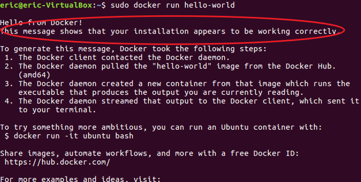
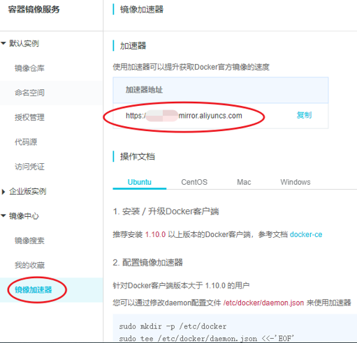

# Hyperledger Fabric 网络体验
## 系统环境配置

1. 操作系统
   
   常见的Linux 发行版（包括Ubuntu 、Redhat 、CentOS 等）和MacOS 等都支持Fabric 编译和运行。
   
   操作系统推荐支持64 位环境。开发环境计算机物理内存建议8 GB以上、虚拟机预留20GB硬盘空间。如果是在生产环境中对性能和稳定性要求高的场景下，甚至需要更多的物理资源。
   
   本教程推荐采用[VirtualBox](https://www.virtualbox.org/wiki/VirtualBox)虚拟机安装Ubuntu 16.04 操作系统。

   先下载安装VirtualBox，然后安装Ubuntu16.04版本。
   
   具体操作请参照官方文档或者[《大话区块链》](https://item.jd.com/12719282.html)一书中**使用最广泛的linux操作系统乌班图**章节。

2. Docker and Docker Compose

   Docker 和 Docker Compose 版本建议使用Docker 19.03 Docker Compose 1.25。

   Docker目前有两个用途，第一个是方便Fabric的部署，另一个是Fabric网络目前采用Docker作为链码（智能合约）容器。

   Docker Compose项目是 Docker 官方的开源项目，用来实现对 Docker 容器集群的快速编排。Docker Compose定位是 “定义和运行多个 Docker 容器应用（Defining and running multi-container Docker applications）”。

   例如,要实现一个 Web 项目，除了 Web 服务容器，还需要后端数据库容器，甚至还包括负载均衡容器等。

   Docker Compose恰好满足了上述需求。它允许用户通过一个单独的 docker-compose.yml 模板文件（YAML 格式）为一个项目定义一组相关联的应用容器。

   Docker的安装可以采用如下命令：

   官方文档：  
   https://docs.docker.com/install/linux/docker-ce/ubuntu/

   ``` 
   $ curl -fsSL https://get.docker.com -o get-docker.sh
   $ sudo sh get-docker.sh
   ```
   建立docker组：
   ```
   $ sudo groupadd docker
   ```
   将当前用户加入 docker 组：
   ```
   $ sudo usermod -aG docker $USER
   ```
   退出当前终端并重新登录，进行如下测试，出现下图提示信息表示Docker安装成功。

   ```
   $ sudo docker run hello-world
   ```
   
   <div align=center>


    

    3-02-01 Docker测试
   </div>

    国内下载镜像的速度比较慢，可以使用国内镜像加速器。具体方式修改daemon配置文件/etc/docker/daemon.json使用加速器。下面以阿里云加速器地址为例。

   ```
   sudo mkdir -p /etc/docker 
   sudo tee /etc/docker/daemon.json <<-'EOF'
   { 
   "registry-mirrors": ["https://hnm*****.mirror.aliyuncs.com"] 
   } 
   EOF 
   sudo systemctl daemon-reload 
   sudo systemctl restart docker
   ```

   镜像加速器地址可以从阿里云网站获取。
   
   官网地址：  
   https://cr.console.aliyun.com/cn-hangzhou/instances/mirrors

   <div align=center>


    

    3-02-02 阿里云镜像加速器
   </div>

   Docker compose的安装可以采用如下命令：  
   官方文档：https://docs.docker.com/compose/install/

   ```
   # Run this command to download the current stable release of Docker 
   # compose:
   sudo curl -L "https://github.com/docker/compose/releases/download/1.25.3/docker-compose-$(uname -s)-$(uname -m)" -o /usr/local/bin/docker-compose

   # Apply executable permissions to the binary:
   sudo chmod +x /usr/local/bin/docker-compose
   ```
3. Go Programming Language
  
   Ubuntu的apt-get自带的go语言版本太低，这里需要重新安装。由于fabric的开发语言是go语言，后续需要对fabric进行编译、运行，因此一定要安装最新版本的go语言环境，否则后面大部分工作无法正常开展。比如出现go path未配置的问题，其原因是go语言版本太低。

   * 使用以下指令进行go语言安装：
     ```
     curl -O https://storage.googleapis.com/golang/go1.10.3.linux-amd64.tar.gz
     sudo tar -C /usr/local -xzf go1.10.3.linux-amd64.tar.gz
     ```
   * 使用编辑器编辑当前用户环境变量：  
     在命令行下输入以下命令：
     ```
     vi ~/.profile 
     ```
     在文件末尾输入以下配置信息：
     ```
     export GOROOT=/usr/local/go 
     export GOPATH=$HOME/go 
     export PATH=$PATH:$GOPATH/bin:$GOROOT/bin
     ```
     在vi编辑器中执行以下命令存盘并退出:
     ```
     ：wq
     ```
    
     在命令行下输入以下命令加载go语言环境变量:
     ```
     source ~/.profile
     ```
     增加了工作组，并将当前用户加入 docker 组，如果还是无法使用，可以使用以下命令修改用户读写权限:

     ```
     sudo chmod 666 /var/run/docker.sock
     ```
4. Node.js Runtime and NPM
   
   Fabric官方目前支持Node.js开发区块链应用，建议使用Node长期支持版本（LTS）。建议使用NVM安装Node.js，NVM可以帮助我们方便的在Node的不同版本之间进行切换，这样我们就可以同时工作在不同的项目上。

   **本教程使用的node版本为8.x或10.x。**  
 
   ```
   # To download and install the nvm script run:
   # 下载并安装nvm脚本：
 
   $ curl -o- https://raw.githubusercontent.com/nvm-sh/nvm/v0.35.2/install.sh | bash

   # close and reopen the terminal or run the commands to add the path to nvm script to the current shell session.
   # 切记nvm安装完毕，要么重新打开终端，要么设置nvm环境变量：

   # Using nvm install node 
   # default install npm
   # 使用nvm安装node：
   $ nvm install node 8.0.0 
   $ nvm install node 10.0.0

   #To list installed Node.js versions type:
   #显示已经安装node版本：
   $ nvm ls

   #You can change the currently active version with:
   #选择使用node版本，这里使用了10.0.0版本：
   $ nvm use 10.0.0

   ```
   node版本维护可以参照官方文档：  
   https://nodejs.org/en/about/releases/

