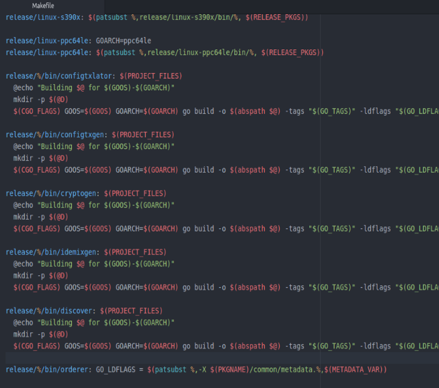
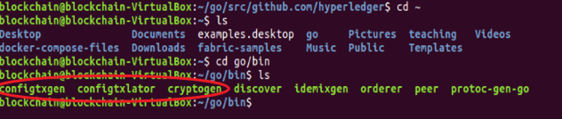
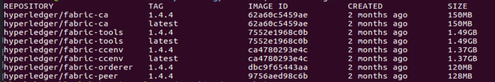

## Hyperledger Fabric 网络体验
### Fabric网络环境
Fabric网络环境搭建有两种方式：

**第一种方式是使用脚本文件直接安装。** 过程比较简单，比较适合学习和了解Fabric网络。

https://hyperledger-fabric.readthedocs.io/en/release-1.4/install.html

```
curl -sSL http://bit.ly/2ysbOFE | bash -s -- <fabric_version> <fabric-ca_version> <thirdparty_version>
curl -sSL http://bit.ly/2ysbOFE | bash -s -- 1.4.4 1.4.4 0.4.18
```
**第二种方式是手动安装。** 这个过程稍微有点复杂，但完整操作完成以后会对Fabric网络有更加深入的理解，方便后续自己手动搭建Fabric网络。这个过程需要手动逐个下载Fabric源代码、使用命令下载Fabric镜像和用Git下载例子程序。

Fabric源代码主要用途是用来编译cryptogen、configtxgen及configtxlator。
使用命令下载必要的Fabric镜像，基本镜像有peer、orderer、ca、tools、ccenv及baseos。例子是官方提供的Fabric案例。

**1. 下载源码**

将Fabric 代码按照Go 语言推荐方式进行存放，创建目录结构并切换到该目录下。具体命令如下：

```
# 创建目录
$ mkdir -p $GOPATH/src/github.com/Hyperledger
# 切换目录
cd $GOPATH/src/github.com/Hyperledger
# 下载fabric源码
git clone https://github.com/hyperledger/fabric.git
# 切换到fabric目录
cd fabric
# 切换到tag v1.4.4 
git checkout v1.4.4 
```
**2.编译辅助工具**

make命令是Linux下系统管理员使用最多的一个命令。管理员可以使用make命令编译和安装开源工具，用来管理大型复杂项目编译问题。由于构建一个复杂项目需要敲gcc命令进行编译，而且还要考虑文件依赖关系，使用make命令可以大幅度降低构建一个复杂工程的难度。

make工具最基本的功能是调用Makefile文件， Makefile文件来描述一个工程的构建过程。当第一次执行make命令时，它会扫描Makefile找到目标及依赖文件，一旦依赖文件编译通过就会编译主目标文件。需要注意的是make命令每次只对修改后的文件进行编译。

<div align=center>


 

3-02-03 Makefile
</div>

进入到fabric目录下，执行如下命令：

```
cd fabric
#生成组织结构和身份文件
$ make cryptogen
#生成配置区块和配置交易
$ make configtxgen
# 解读配置信息
$ make configtxlator
```
编译完成后，我们就会在go/bin目录下看到cryptogen、configtxgen和configtxlator三个工具。

<div align=center>


 

3-02-04 编译后的Fabric工具
</div>

**3.下载镜像文件**

Docker镜像可以从源代码编译生成，也可以从DockerHub仓库中下载。目前Fabric的镜像有十几个，本教程用到的主要镜像文件如下：

* hyperledger/ fabric-ca    # fabric-ca 镜像
* hyperledger/ fabric-tools  # 安装了peer 、cryptogen、configtxgen 等，可作为测试客户端使用支持
* hyperledger/fabric-ccenv  #go语言的链码基础镜像，其中安装了chaintool 、Go 语言的链码shim 层
* hyperledger/ fabric-orderer  #orderer节点镜像
* hyperledger/ fabric-peer  #peer节点镜像

如果我们没有对Fabric源码进行修改，可以直接从Dockerhub拉取相关镜像，命令格式为：  
Docker pull <IMAGE_NAME:TAG>

要拉取本课程中使用到的镜像可以使用如下命令：

```
ARCH=x86_64
IMAGE_TAG=1.4.4
CA_VERSION=1.4.4
BASE_IMAGE_VERSION=0.4.18

# pull images

docker pull hyperledger/fabric-peer:$IMAGE_TAG \
&& docker pull hyperledger/fabric-orderer:$IMAGE_TAG \
&& docker pull hyperledger/fabric-ca:$CA_VERSION \
&& docker pull hyperledger/fabric-tools:$IMAGE_TAG \
&& docker pull hyperledger/fabric-ccenv:$IMAGE_TAG \
&& docker pull hyperledger/fabric-baseos:$BASE_IMAGE_VERSION

# add fabric-peer fabric-orderer fabric-ca fabric-tools

docker tag  hyperledger/fabric-peer:$IMAGE_TAG hyperledger/fabric-peer \
docker tag  hyperledger/fabric-orderer:$IMAGE_TAG hyperledger/fabric-orderer \   
docker tag  hyperledger/fabric-ca:$CA_VERSION hyperledger/fabric-ca \   
docker tag  hyperledger/fabric-tools:$IMAGE_TAG hyperledger/fabric-tools
```
成功执行完命令之后，输入docker images就会出现如下镜像：

<div align=center>


 

3-02-05 Fabric主要镜像文件
</div>

**4. 下载例子程序**

进入到Ubuntu用户目录下，输入以下命令下载例子程序，并切换与镜像文件相同的1.4.4版本，确保程序可以正常运行。

```
# clone the hyperledger/fabric-samples repository
git clone https://github.com/hyperledger/fabric-samples.git

# Checkout the appropriate version tag
git checkout v1.4.4
```
进入到fabric-examples目录下，可以看到fabcar和commercial paper两个例子，可以参考官方文档进行学习。