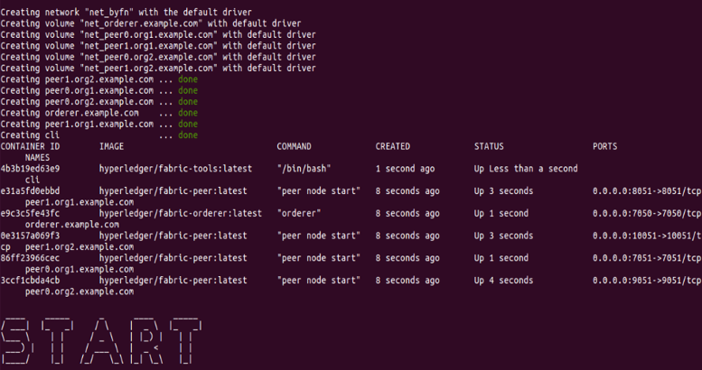
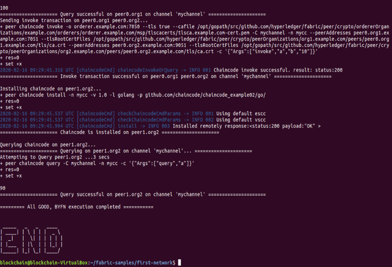

# Hyperledger Fabric 网络体验
## 网络启动过程概览

现在使用刚才下载例子程序，输入以下命令进入first-networ目录：

```
cd fabric-samples/first-network
ls
```
可以看到该目录下docker-compose的配置文件和byfn.sh的脚本文件，输入以下命令：

```
./byfn.sh 
```
可以查看该命令的使用说明。  
输入默认命令：
```
./byfn.sh up
```
就会看到屏幕上显示的启动信息。作为第一次Fabric网络体验，我们先简单了解一下网络启动过程中都发生了那些事情。从大的方面来看，网络启动主要包含三个操作，分别是生成**配置文件**、**启动网络**和**操作网络**。

**1. 配置文件**

* 使用cryptogen tool生成证书文件（给组织颁发证书）
* 生成Orderer节点的创世区块genesis.block（创世区块）
* 生成通道配置交易文件 channel.tx（通道是fabric独有的机制，相当于是一个子链）
* 为组织1和组织2创建锚节点（锚节点是一个负责对外通讯的节点）

<div align=center>


 

3-02-04 配置文件
</div>

**2. 启动网络**
* 启动了4peer节点
* 启动了一个orderer节点
* 启动了一个管理工具

<div align=center>


 

3-02-05 启动网络
</div>

**3. 操作网络**

* 创建mychannel通道

* 组织1的Peer0加入mychannel通道
* 组织1的Peer1加入mychannel通道
* 组织2的Peer0加入mychannel通道
* 组织2的Peer1加入mychannel通道

* 更新组织1的锚节点
* 更新组织2的锚节点

* 将链码安装到组织1 的Peer0节点
* 将链码安装到组织2 的Peer0节点

* 链码初始化（只需要初始化一次）

* 在组织1的peer0节点上进行链码查询（a=100）
* 在组织1的peer0节点进行invoke操作(a向B转账10元)
* 将链码安装到组织2的peer1节点上
* 在组织2的peer1上查询链码（a=90）

<div align=center>


 

3-02-06 操作网络
</div>