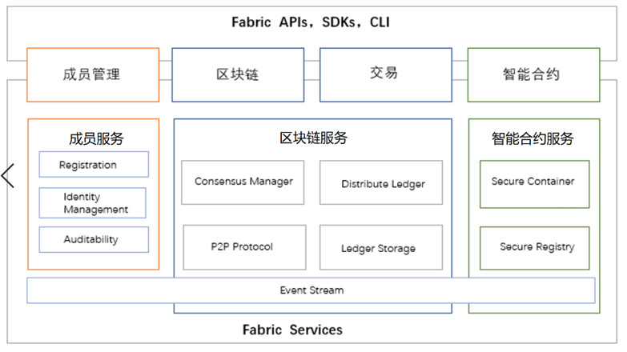
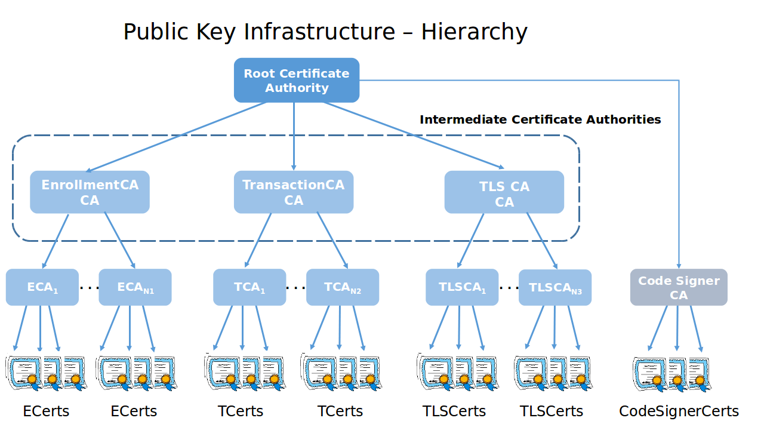

## Hyperledger Fabric系统架构
### 核心特性
目前，超级账本Fabric 架构的核心特性主要包括：

* 解耦了原子排序环节与其他复杂处理环节，消除了网络处理瓶颈，提高了可扩展性；解耦交易处理节点的逻辑角色为背书节点（ Endorser ）、确认节点（ Committer ），可以根据负载进行灵活部署；
* 加强了身份证书管理服务，作为单独的Fabric CA 项目，提供更多功能；
* 支持多通道特性，不同通道之间的数据彼此隔离，提高隔离安全性；
* 支持可拔插的架构，包括共识、权限管理、加解密、账本机制等模块，支持多种类型；
* 引人系统链码来实现区块链系统的处理，支持可编程和第三方实现。
* 长期支持版本1.4，支持Raft共识机制。

### 技术架构
Hyperledger Fabric是目前超级账本项目中发展最好的子项目，被广泛应用于跨企业的业务流程改造中。Fabric是一个分布式账本解决方案平台，采用模块化架构，支持不同组件的可插拔实现，以适应业务系统的复杂性。

与比特币、以太坊不同的是，Hyperledger Fabric网络成员加入依赖于成员服务提供者（Membership Service Provider, MSP）注册，而不是允许任何人通过工作量证明机制或者权益证明机制参与网络。

比特币网络中，由于任何成员都可以加入，因此需要采用工作量证明机制来防止用户作恶。Fabric节点加入需要身份认证，因此弱化了节点作恶，在性能和隐私保护方面足以满足政府、企业区块链应用的需求。

在Fabric中有一个独立的Fabric CA模块，用来管理证书服务，当然Fabric也允许第三方CA机构的接入。我们可以把Fabric CA想象成为Fabric区块链平台上的公安局，专门进行证书发放、管理和身份验证。

除支持多种MSP服务之外，Hyperledger Fabric还支持账本存储和共识机制的切换。

分布式账本支持LevelDB（由Google公司研发的键值对嵌入式数据库管理系统）和CouchDB（由Apache软件基金会开发的一个面向文档的开源数据库管理系统），CouchDB是一种key/value的数据存储方式，并且支持JSON格式的查询。

共识机制目前支持SOLO（只限于开发）和Kafka（一种消息平台）、Raft（相比Kafka更去中心化）三种。

隐私保护方面，Hyperledger Fabric还提供创建秘密通道（channel）的功能，允许一组参与者建立自己单独的通道。在企业实际业务中，由于一些参与者可能是竞争对手，如果不希望某些交易的价格被其他人知道，可以在参与者之间建立一个秘密通道，这些价格信息只有参与者知道，其他人无法获得具体价格信息。

Hyperledger Fabric在公链技术的基础上，采用授权方式和通道机制（Channel），使得Fabric的安全和隐私保护方面已经达到了商用化的标准。

Fabric首次将权限管理机制引人区块链领域，其可扩展的架构设计、开放的接口风格、可拔插的组件化实现为分布式账本平台的设计和实现提供了重要的参考依据。

从体系架构上看，Fabric分为四大模块，分别是成员服务、区块链服务、智能合约和应用编程接口。

  
3-03-01 Fabric系统架构

**1. 成员服务**

成员服务（MSP）主要提供证书发布、验证及相关加密机制和协议。成员服务内置了Fabric CA证书颁发机构（Certificate Authority,CA）供基于PKI体系的身份证书管理服务，同时也允许第三方证书认证机构接入。

Fabric CA提供客户端和SDK两种方式与CA进行交互，每个Fabric CA都有一个根CA或者中间CA。为了保证CA的安全性，中间CA可以采用集群方式搭建。

  
3-03-02 Fabric CA图表

实践中，为了便于证书管理，一般使用根证书、业务证书、用户证书三级证书结构。根证书（最高级别的证书）用来签发业务证书，业务证书用来签发具体的用户证书，由此形成一个以根证书为顶层的树状结构，这种关系下，所有下层证书都会继承根证书的信任体系。

不同的交易环节中，Fabric使用了不同的业务证书，Enrollment Cert属于身份认证证书，Transaction Cert属于交易签名证书，TLS-Cert属于安全通讯证书。

  
3-03-03 CA三级证书结构

**2. 区块链服务**

区块链服务用于维护分布式账本。区块链服务包括P2P协议、分布式账本和共识机制管理。

1. **P2P协议**  
  Fabric网络中，Peer和Orderer采用gRPC（Google RPC）对外提供远程服务，供客户端进行调用。网络中的节点之间通过Gossip 协议来进行状态同步和分发。

2. **共识机制**  
   区块链网络中，不同参与者之间，交易必须按照发生的顺序写入到分布式账本中。为此必须建立事务的顺序，并且采用一种共识机制拒绝错误（或恶意）的交易数据。
   
   Fabric允许根据实际业务需要选择合适的共识机制，目前支持SOLO、Kafka、Raft三种共识机制。

3. **分布式账本**  
   分布式账本包括两个组件：世界状态（world state）、事务日志，分布式账本是世界状态数据库和事务日志历史记录的组合。
   
   世界状态（world state）组件记录的是最新的分布式账本状态，事务日志组件记录的是世界状态的更新历史。

**3. 智能合约服务**  
   智能合约服务用于保证智能合约在网络节点上安全运行。
   
   智能合约是一组运行在验证节点上的去中心化交易程序。在Fabric中智能合约被称为链码（chaincode），由外部应用程序（比如网页、APP）与分布式账本进行交互。
   
   Fabric的智能合约使用Docker存放链上的代码，而不需要依靠特定的虚拟机，Docker为链码执行提供了一个安全、轻便的语言执行环境。

**4. 应用编程接口**  
   应用编程接口提供SDK（开发工具包）和CLI（命令行）两种方式供开发人员使用区块链的各种服务。Fabric提供了一套易用、可灵活扩展的API接口。用户可以非常方便地使用SDK（开发工具包）和CLI（命令行）对分布式账本进行查询、更新。

   **在网络搭建部分我们使用命令行的方式进行网络环境的验证，在实际案例开发中我们会使用SDK与网络进行交互。**
