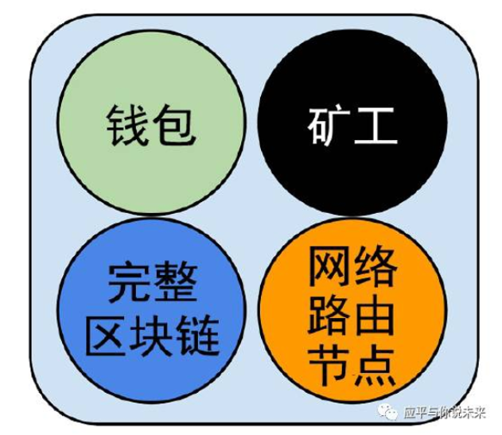

# Hyperledger Fabric核心组件

要理解Fabric的设计，需要对Fabric核心组件进行进一步学习掌握Fabric的底层运行原理，才能真正理解Fabric的设计初衷。

## Fabric网络（Network）

在Fabric网络中，Peer和Orderer采用gRPC（Google RPC）对外提供远程服务，供客户端进行调用。网络中的节点之间通过Gossip 协议来进行状态同步和分发。
Gossip 协议是P2P 领域的常见协议，用于进行网络内多个节点之间的数据分发或信息交换。由于其设计简单，容易实现，同时容错性比较高，而被广泛应用到了许多分布式系。

Gossip 协议的基本思想十分简单，数据发送方从网络中随机选取若干节点，将数据发送过去，接收方重复这一过程（往往只选择发送方之外节点进行传播）。这一过程持续下去，网络中所有节点最终（时间复杂度为节点总个数的对数）都会达到一致。数据传输的方向可以是发送方发送或获取方拉取。

与其它区块链节点一样，一个完整的区块链网络中各个节点会有不同分工。我们先看看比特币网络。每个比特币节点都是路由、区块链数据库、挖矿、钱包服务的功能集合，一个全节点包含钱包、矿工、完整区块链、网络路由节点。

  
3-04 比特币网络

钱包节点一般是运行在PC和手机上的轻节点。钱包是比特币的重要组成部分，与大部分人理解不一样的是，钱包里没有比特币，只有比特币私钥。我们在钱包里看到的余额是钱包根据私钥计算得到的。在比特币等公链中，私钥是有用户保管的，一旦私钥丢失就意味着该用户的代币丢失。据说现在由于私钥保护不善，有300多万枚比特币已经丢失。

挖矿节点就是我们俗称的矿机。挖矿节点通过运行在特殊硬件设备上的工作量证明（proof-of-work）算法，以相互竞争的方式创建新的区块。一些挖矿节点同时也是全节点，保有区块链的完整拷贝；还有一些参与矿池挖矿的节点是轻量级节点，它们必须依赖矿池服务器维护的全节点进行工作。

目前，Fabric网络中存在以下4 种不同种类的服务节点，彼此协作完成整个区块链系统的功能。对网络中节点角色进行解耦是Fabric 设计中的一大创新，这也是联盟链场景下的特殊需求和环境所决定。

* 背书节点（ Endorser ）：负责对交易的提案（ proposal ）进行验证并模拟交易执行；

* 提交节点（ Committer ）： 负责在接受交易结果前再次检查合法性，接受合法交易对账本的修改，并写入区块链结构；

* 排序节点（ Orderer ） ： 对所有发往网络中的交易进行排序，将排序后的交易按照配置中的约定整理为区块，之后提交给确认节点进行处理；

* 证书节点（ CA ）： 负责对网络中所有的证书进行管理，提供标准的PKI服务。

**通常情况下，除了用户节点，Fabric网络所有的全节点都具备Commiter功能，部分节点具有Endorser、Orderer功能。锚节点是一种外部可发现的节点，配置了对外服务的端口，如果某个Peer节点被配置成锚节点，这就意味着该节点可以被Orderer节点和其它任何节点发现。证书节点是一个相对独立证书管理机构，也可以由第三方证书机构来承担这个角色。**

## Fabric共识（Orderer）

在第一章节中，我们提到共识机制就是保证不同计算机之间信息的一致性。

在Fabric中，广义的共识机制包含背书、排序和验证三个环节，狭义的共识指的是排序。

所谓背书就是相关组织对交易的认可，在Fabric中是相关节点对交易进行签名。在比特币、以太坊等区块链上，网络上所有节点都可以生成有效的交易。而Fabric更符合真实世界的情况，交易验证由网络中业务相关方进行验证。对于一个链码交易来说，背书策略是在链码实例化的时候指定的，一笔有效交易必须是背书策略相关组织签名后才能生效。

举个例子，车辆交易就必须由买卖双方共同签署才能生效。背书策略的设计更符合真实世界情况。

排序服务通常由排序节点来提供，用来对全网交易达成一致顺序。排序服务只负责对交易顺序达成一致，这就有效避免了整个网络瓶颈，而且排序节点也很容易横向扩展，以提高整个网络的效率。排序服务目前支持Kafka和Raft两种。

Fabric1.4.1中提供了Raft共识机制。Raft共识机制属于非拜占庭的共识机制，使用了领导者和跟随者（leader and follower）模型，当一个leader被选出，日志信息会从Leader向Follower单向复制。Raft比Kafka更容易管理，在设计上允许所有的节点都可以成为Orderer节点，相比Kafka更去中心化。

当然Fabric可插拔架构也允许根据业务需要设计符合拜占庭的共识机制，比如Practical Byzantine Fault Tolerance (PBFT ），但这种共识机制的性能往往比较差。

验证是对排序后的交易提交到账本之前最终的检查。检查的内容包含交易结构的合法性、交易背书签名是否符合背书策略等。

## Fabric账本（Ledger）

在第一章节时我们通过比特币讲解过交易、区块、区块链这些概念，这里我们通过Fabric复习一下。在比特币中，交易信息里只包含了货币相关信息，在Fabric中交易（ transaction ）可以存储相关业务信息，比如一个苹果、一条鱼等等。区块（ block ）是一组排序后的交易集合，将区块通过密码算法连接起来就是区块链。

账本（ ledger ）对区块链结构进行了进一步的延伸，是Fabric 中十分关键的一个结构。账本包含状态数据库（World State）和历史数据库。状态数据库记录的是变更记录的最新结果，方便查询，历史数据库记录的是区块链结构。在数据库选型上，为了方便查询，状态数据库会使用CouchDB,历史数据库会使用LevelDB。

在Fabric中，通道隔离了交易，因此每个通道都拥有独立账本。

## Fabric链码（Chaincode）

智能合约在Fabric中也被称为链码（chaincode）。

目前超级账本Fabric 项目中提供了用户链码和系统链码。用户链码运行在单独的容器中，提供对上层应用的支持。系统链码则嵌入在系统内，提供对系统进行配置、管理的支持。

一般所谈的链码为用户链码，用户通过链码相关的API 编写用户链码，即可对账本中状态进行更新操作。系统链码有以下五个合约：

* Configuration System Chaincode (CSCC)
CSCC 管理peer上通道相关的信息以及执行通道配置交易。

* Life Cycle System Chaincode (LSCC)
LSCC 用于管理链码的生命周期——在peer上安装链码、在通道上实例化和升级链码、用户从运行中的链码获取信息。

* Query System Chaincode (QSCC)
运行在所有Peer上，提供账区块查询、交易查询等API。

* Endorser System Chaincode (ESCC)
ESCC 由背书节点调用，对一个交易响应进行密码签名。

* Validator System Chaincode (VSCC)
VSCC 由记账节点调用, 包括检查背书策略和读写集版本。

链码经过安装和实例化操作后，即可被调用。在安装时候，需要指定具体安装到哪个Peer 节点，实例化时还需要指定通道内及背书策略。链码之间还可以通过互相调用，创建更灵活的应用逻辑。Fabric 目前主要支持基于Go 语言、Java、Node.js。
