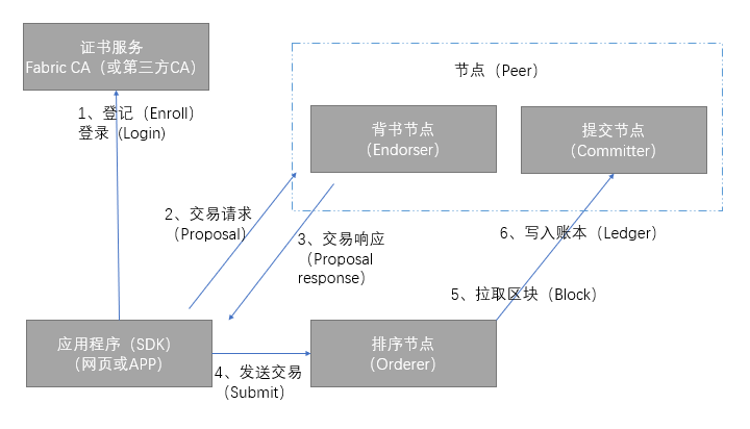

## Hyperledger Fabric 典型交易流程

理解了Fabric设计之后，我们再进一步了解一下交易在Fabric组件之间的工作流程。一个完整的交易要涉及应用程序、证书服务、背书节点、提交节点和排序节点。

* 应用程序（App）：调用Fabric SDK与区块链网络进行交互，这里的应用程序可以是网页，也可以是APP；  
  
* 证书节点（ CA ）：负责对网络中所有的证书进行管理，提供标准的PKI服务；
  
*  背书节点（ Endorser ）：负责对交易的提案（ proposal）进行验证并进行模拟执行。背书节点相当于中立的第三方，用来保证交易的合法性；
  
* 排序节点（ Orderer ）：对所有发往网络中的交易进行排序，将排序后的交易按照配置中的约定整理为区块，之后广播给提交节点（committer）进行处理；
  
* 提交节点（ Committer ）：负责再次检查交易的合法性，接受合法交易对账本的修改，并写入区块链结构。

  
3-05 Fabric典型交易流程

上图中，客户端（App）使用SDK与Fabric网络进行交互。

1.	客户端先通过证书服务获取合法的身份并加入到应用通道（Channel）中。

2.	客户端构造交易请求（Proposal）提交给背书节点（Endorser）。

3.	背书节点对交易进行验证和模拟执行后（并不真正更新账本），反馈给客户端。

4.	客户端收到足够的背书支持后将交易发送给Orderer节点。

5.	Orderer节点对网络中的交易进行全局排序，并将排序后的交易打包成区块，然后广播给网络中的提交节点（Committer）。

6.	提交节点（Committer）负责维护区块链和账本结构，对交易进行最终检查（交易结构的合法性、交易背书签名是否符合背书策略等），检查通过后写入账本。