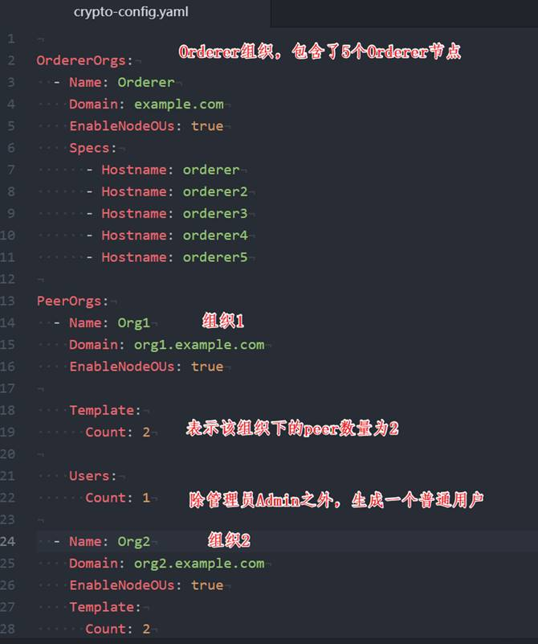
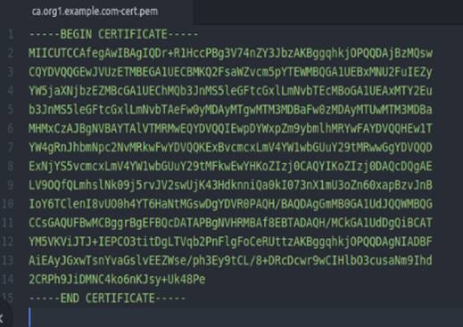
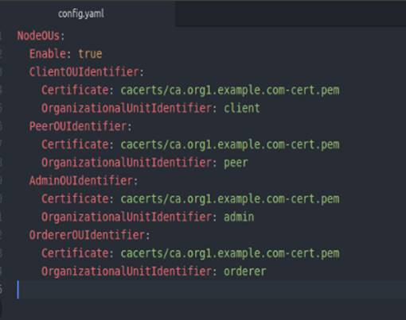

## 生成证书文件

使用cryptogen工具为Orderer节点和Peer节点生成证书文件。这些证书文件用来代表节点Orderer节点和Peer节点的身份，用于节点之间通讯加密和交易签名、验签。

生成证书文件需要依赖crypto-config.yaml文件。crypto-config.yaml包含了网络的拓扑结构，使用cryptogen工具根据网络拓扑为每个Peer节点和Orderer节点生成对应的证书文件。使用这些证书的私钥和公钥可以对Fabric网络中通讯和交易进行加密和签名。

<div align=center>


 

4-02_01 crypto-config.yaml文件
</div>

在网络根目录下，输入以下命令：
```
cryptogen generate --config=./crypto-config.yaml
```
在命令行会输出以下信息。
```
org1.example.com
org2.example.com
```
在当前目录下会生成一个crypto-config目录，该目录下生成了Orderer节点和Peer节点对应的证书文件（如下所示）。

```
├── ordererOrganizations
│   └── example.com
│       ├── ca
│       │   ├── 4543ec84197ce3c473e1cc8ab90af59e2b439303189cc96a1d776455288e10e4_sk
│       │   └── ca.example.com-cert.pem
│       ├── msp
│       │   ├── admincerts
│       │   ├── cacerts
│       │   ├── config.yaml
│       │   └── tlscacerts
│       ├── orderers
│       │   ├── orderer2.example.com
│       │   ├── orderer3.example.com
│       │   ├── orderer4.example.com
│       │   ├── orderer5.example.com
│       │   └── orderer.example.com
│       ├── tlsca
│       │   ├── 01337266be631763d6a7f67d81ffc531e0f5ef8991a5f627090e9416112c19f9_sk
│       │   └── tlsca.example.com-cert.pem
│       └── users
│           └── Admin@example.com
└── peerOrganizations
    ├── org1.example.com
    │   ├── ca
    │   │   ├── 1d01bec3ab8d756d020bd905e68ec8a4e084a3d7b081c992b2f7d27def07618f_sk
    │   │   └── ca.org1.example.com-cert.pem
    │   ├── msp
    │   │   ├── admincerts
    │   │   ├── cacerts
    │   │   ├── config.yaml
    │   │   └── tlscacerts
    │   ├── peers
    │   │   ├── peer0.org1.example.com
    │   │   └── peer1.org1.example.com
    │   ├── tlsca
    │   │   ├── deb1c11cec0feb94c7b6a8245b4fa5de38d52162782aefcdb4e75b8733880986_sk
    │   │   └── tlsca.org1.example.com-cert.pem
    │   └── users
    │       ├── Admin@org1.example.com
    │       └── User1@org1.example.com
    └── org2.example.com
        ├── ca
        │   ├── 997766aa43eacbf419d8b23ffb8c4b64a9c97de22a1bb5abd05f96f526c0574b_sk
        │   └── ca.org2.example.com-cert.pem
        ├── msp
        │   ├── admincerts
        │   ├── cacerts
        │   ├── config.yaml
        │   └── tlscacerts
        ├── peers
        │   ├── peer0.org2.example.com
        │   └── peer1.org2.example.com
        ├── tlsca
        │   ├── 40e7ef86f4cac43273b6f67df8bf94278389a5eb4e0bc2d393a8e4f620cc794d_sk
        │   └── tlsca.org2.example.com-cert.pem
        └── users
            ├── Admin@org2.example.com
            └── User1@org2.example.com

```
**知识点：**

cryptogen 模块生成的文件中包含了Fabric 账号相关的证书文件。为满足区块链的不可篡改特性，Fabric 中每条交易都会加上发起者的签名。如果交易需要其他组织的节点提供背书功能，那么背书节点也会在交易中加入自己的签名。这样每一笔交易的操作过程会非常清晰并且不可篡改。

```
        ├── msp
        │   ├── admincerts
        │   ├── cacerts
        │   ├── config.yaml
        │   └── tlscacerts

```
* admincerts 包含了PEM格式的管理员证书文件。
* cacerts 包含了PEM格式的CA根证书文件。
<div align=center>


 

4-02_02 ca.org1.example.com-cert.pem文件
</div>

* config.ymal 用来配置支持的组织单元和身份分类的配置文件。
<div align=center>


 

4-02_03 config.yaml文件
</div>
* tlscacerts 包含了PEM格式的TLS CA根证书文件。