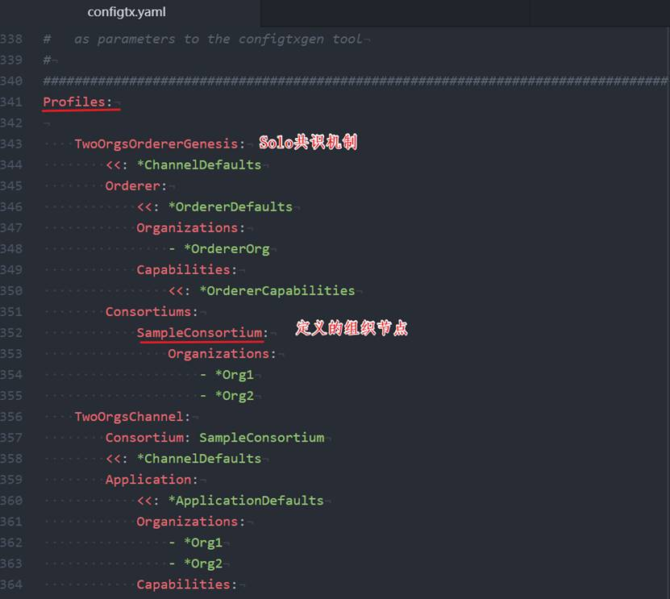
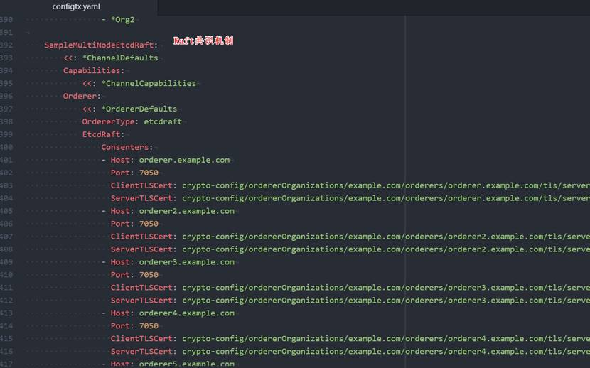
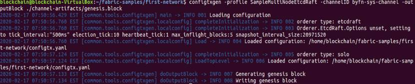
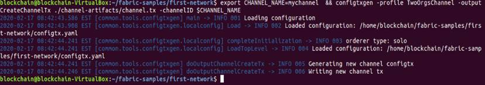
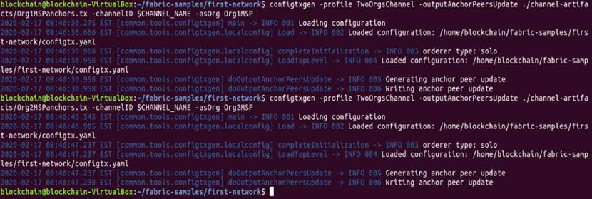

# 生成交易相关文件
使用configtxgen工具生成Orderer的创世区块文件、通道配置交易文件以及锚节点交易文件。

创世区块是Orderer服务的第一个区块，通道配置文件会在之后创建通道时广播到Orderer节点，锚节点交易文件是指定各组织对外通讯的节点。

生成交易相关文件需要依赖configtx.yaml文件。configtx.yaml文件包含了网络中的组织信息，其中包含一个Orderer组织（OrdererOrg）和两个Peer组织（Org1和Org2）。特别要注意的是在文件末尾有几个独立的profiles，定义了不同共识机制对的应创世区块，SampleConsortium下定义了Org1和Org2两个组织。

* TwoOrgsOrdererGenesis: 生成Solo共识机制的创世区块。
* SampleMultiNodeEtcdRaft: 生成Raft共识机制的创世区块。
* SampleDevModeKafka: 生成Kafka共识机制的创世区块。
* TwoOrgsChannel: 为mychannel生成创世区块。

<div align=center>


 

4-03_01 configtx.yaml文件1
 

4-03_02 configtx.yaml文件2
</div>

## 生成创世区块文件

在网络根目录下，输入以下命令：

```
# 定义Fabric配置文件路径环境变量
export FABRIC_CFG_PATH=$PWD
```
以下命令使用profile TwoOrgsOrdererGenesis 创建Solo共识机制的创世区块。
```
configtxgen -profile TwoOrgsOrdererGenesis -channelID byfn-sys-channel -outputBlock ./channel-artifacts/genesis.block
```
以下命令使用profile SampleDevModeKafka创建Kafka共识机制的创世区块。
```
configtxgen -profile SampleDevModeKafka -channelID byfn-sys-channel -outputBlock ./channel-artifacts/genesis.block
```
以下命令使用profile SampleMultiNodeEtcdRaft创建Raft共识机制的创世区块。
```
configtxgen -profile SampleMultiNodeEtcdRaft -channelID byfn-sys-channel -outputBlock ./channel-artifacts/genesis.block
```
**为了符合生产环境网络情况，本教程采用Raft共识机制创建创世区块**，执行完命令输出以下信息：
<div align=center>


 

4-03_03 成功创建创世区块
</div>

创世区块文件和后续的文件都会保存在channel-artifacts目录下。这里的channelID是系统通道的名字。

## 生成通道配置文件
**创建通道配置交易文件**。执行以下命令：
```
# The channel.tx artifact contains the definitions for my channel

export CHANNEL_NAME=mychannel  && configtxgen -profile TwoOrgsChannel -outputCreateChannelTx ./channel-artifacts/channel.tx -channelID $CHANNEL_NAME
```
执行完命令后输出以下信息：
<div align=center>


 

4-03_04 成功创建应用通道配置交易文件
</div>

**生成锚节点交易文件。** 为Org1和Org2生成锚节点交易文件。输入以下命令：
```
configtxgen -profile TwoOrgsChannel -outputAnchorPeersUpdate ./channel-artifacts/Org1MSPanchors.tx -channelID $CHANNEL_NAME -asOrg Org1MSP


configtxgen -profile TwoOrgsChannel -outputAnchorPeersUpdate ./channel-artifacts/Org2MSPanchors.tx -channelID $CHANNEL_NAME -asOrg Org2MSP
```
<div align=center>


 

4-03_05 成功创建锚节点
</div>
**注意：创世区块文件、通道配置交易文件以及需要的锚节点交易文件生成后会在channel-artifacts目录下生成channel.tx、genesis.block、 Org1MSPanchors.tx 、Org2MSPanchors.tx四个文件。**

**通道知识点**

通道是Fabric中非常重要的概念，它实际上是由排序节点划分和管理的私有原子广播通道，目的是对通道的信息进行隔离，使得通道外的实体无法访问通道内的信息，从而实现交易的隐私性。

目前通道分为系统通道（System Channel）和应用通道（Application Channel）。排序节点通过系统通道来管理应用通道，用户的交易信息通过应用通道传递。对一般用户来说，通道是指应用通道。

