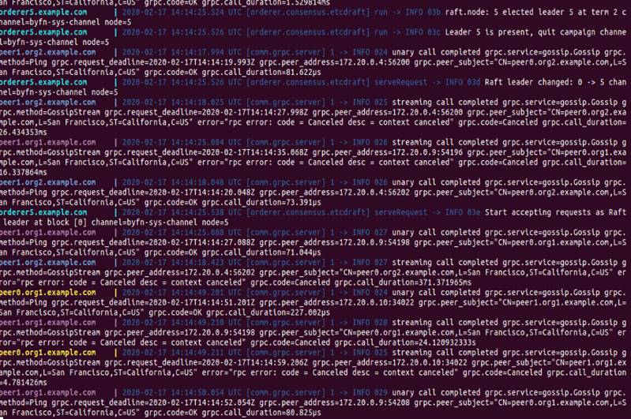
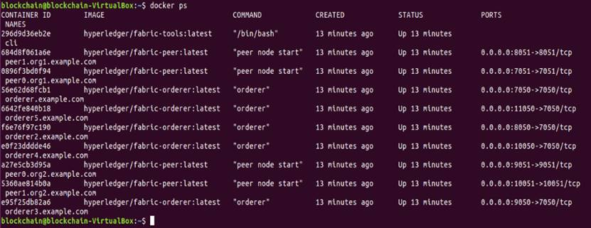

## 启动网络节点

证书、创世区块文件、通道配置交易文件以及锚节点交易文件准备好后，输入以下命令启动Raft网络。

```
docker-compose -f docker-compose-cli.yaml -f docker-compose-etcdraft2.yaml up 
```
如这时候会在屏幕看到如下图显示的Orderer、Peer日志启动信息，这个过程需要一点时间（如果不想看到日志信息可以在上面docker-compose命令加上 -d ，让Orderer和Peer节点在后台启动）。

<div align=center>


 

4-04_01 成功启动Fabric网络
</div>

打开一个新的命令窗口，输入以下命令：
```
# 显示所有的容器
docker ps 
```
<div align=center>


 

4-04_02 查看所有容器
</div>

从上图可以看到启动了5个Orderer节点，四个Peer节点和一个命令行管理节点。

**Docker Compose知识点**  

在命令行输入docker-compose [-f <arg>...] [options] [COMMAND] [ARGS...] 可以在容器中build和管理多个服务。在命令行输入docker-compose –help 可以看到帮助信息。

```
Define and run multi-container applications with Docker.

Usage:
  docker-compose [-f <arg>...] [options] [COMMAND] [ARGS...]
  docker-compose -h|--help

Options:
  -f, --file FILE             Specify an alternate compose file
                              (default: docker-compose.yml)
  -p, --project-name NAME     Specify an alternate project name
                              (default: directory name)
  --verbose                   Show more output
  --log-level LEVEL           Set log level (DEBUG, INFO, WARNING, ERROR, CRITICAL)
  --no-ansi                   Do not print ANSI control characters
  -v, --version               Print version and exit
  -H, --host HOST             Daemon socket to connect to

  --tls                       Use TLS; implied by --tlsverify
  --tlscacert CA_PATH         Trust certs signed only by this CA
  --tlscert CLIENT_CERT_PATH  Path to TLS certificate file
  --tlskey TLS_KEY_PATH       Path to TLS key file
  --tlsverify                 Use TLS and verify the remote
  --skip-hostname-check       Don't check the daemon's hostname against the
                              name specified in the client certificate
  --project-directory PATH    Specify an alternate working directory
                              (default: the path of the Compose file)
  --compatibility             If set, Compose will attempt to convert deploy
                              keys in v3 files to their non-Swarm equivalent

Commands:
  build              Build or rebuild services
  bundle             Generate a Docker bundle from the Compose file
  config             Validate and view the Compose file
  create             Create services
  down               Stop and remove containers, networks, images, and volumes
  events             Receive real time events from containers
  exec               Execute a command in a running container
  help               Get help on a command
  images             List images
  kill               Kill containers
  logs               View output from containers
  pause              Pause services
  port               Print the public port for a port binding
  ps                 List containers
  pull               Pull service images
  push               Push service images
  restart            Restart services
  rm                 Remove stopped containers
  run                Run a one-off command
  scale              Set number of containers for a service
  start              Start services
  stop               Stop services
  top                Display the running processes
  unpause            Unpause services
  up                 Create and start containers
  version            Show the Docker-Compose version information
```