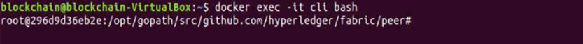
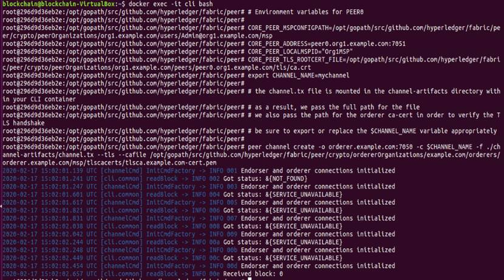
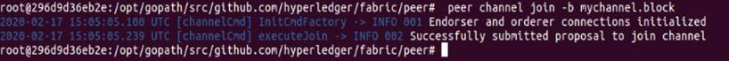
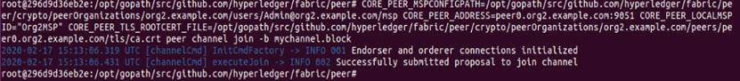
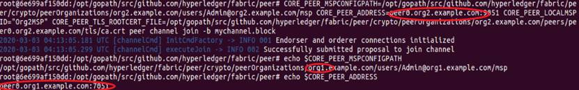
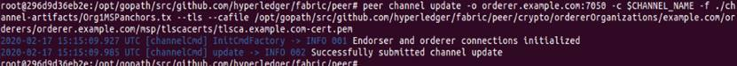
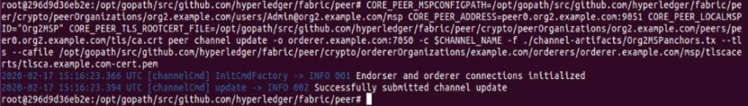

## 网络配置
### 创建通道

如果有需要，可以使用参照4.3.2继续创建通道配置交易文件。这里我们使用上面已经创建的通道配置交易文件（channel.tx）创建mychannel。

在命令行窗口输入以下命令：
```
docker exec -it cli bash
```
成功执行后，进入如下管理界面：
<div align=center>


 

4-05_01 进入管理界面
</div>

**注意：命令行管理节点默认环境是 peer0.org1.example.com。下图docker-compose-cli.yaml中配置了四个环境变量，如果要管理Org2节点，一定要用新的环境变量覆盖现有配置。**

<div align=center>


 

4-05_02 docker-compose-cli.yaml文件
</div>

环境变量的解释如下：
```
# Environment variables for PEER0

CORE_PEER_MSPCONFIGPATH=/opt/gopath/src/github.com/hyperledger/fabric/peer/crypto/peerOrganizations/org1.example.com/users/Admin@org1.example.com/msp
CORE_PEER_ADDRESS=peer0.org1.example.com:7051
CORE_PEER_LOCALMSPID="Org1MSP"
CORE_PEER_TLS_ROOTCERT_FILE=/opt/gopath/src/github.com/hyperledger/fabric/peer/crypto/peerOrganizations/org1.example.com/peers/peer0.org1.example.com/tls/ca.crt

CORE_PEER_MSPCONFIGPATH       Org1 Admin的MSP证书文件
CORE_PEER_ADDRESS              peer0的地址
CORE_PEER_LOCALMSPID           Org1 MSP ID
CORE_PEER_TLS_ROOTCERT_FILE   Org1的TLS根证书文件，与Orderer进行加密通讯
```
输入以下命令创建通道：
```
export CHANNEL_NAME=mychannel

# the channel.tx file is mounted in the channel-artifacts directory within your CLI container
# as a result, we pass the full path for the file
# we also pass the path for the orderer ca-cert in order to verify the TLS handshake
# be sure to export or replace the $CHANNEL_NAME variable appropriately

peer channel create -o orderer.example.com:7050 -c $CHANNEL_NAME -f ./channel-artifacts/channel.tx --tls --cafile /opt/gopath/src/github.com/hyperledger/fabric/peer/crypto/ordererOrganizations/example.com/orderers/orderer.example.com/msp/tlscacerts/tlsca.example.com-cert.pem
```
创建成功后，可以看到下图信息。
<div align=center>


 

4-05_03 成功完成通道创建
</div>

**创建通道的知识点**

peer channel命令包含以下7个子命令：:
* create
* fetch
* getinfo
* join
* list
* signconfigtx
* update

peer channel create命令是用来创建一个通道，并输出一个创世区块—— (mychannel.block)——包含了指定的通道配置信息，存储在Peer的文件系统中。具体用法如下：
```
-o, --orderer string       Ordering service endpoint
-c, --channelID string     通道名称，名字必须全部是小写，少于250个字符，正则表 达式： [a-z][a-z0-9.-]*
-f, --file string          配置通道交易文件用来提交给orderer节点
--tls                      与orderer交互时使用TLS进行通道加密，这里使用的是 orderer的tlscacerts下的pem证书
```

### 加入通道
输入以下命令将Org1的Peer0加入通道：
```
# By default, this joins ``peer0.org1.example.com`` only
# the <CHANNEL_NAME.block> was returned by the previous command
# if you have not modified the channel name, you will join with mychannel.block
# if you have created a different channel name, then pass in the appropriately named block

peer channel join -b mychannel.block
```
<div align=center>


 

4-05_04 Org1 Peer0 成功加入通道
</div>

通过管理节点将组织Org2节点加入通道，需要指定所操作的指定组织Admin的MSP证书文件、peer的地址、组织 MSP ID、组织的TLS根证书文件，以及通道的创世区块——创建通道时产生的通道创世区块（mychannel.block）。

设置Org2的Peer0的环境变量，使用以下命令将Org2的Peer0加入通道：

```
CORE_PEER_MSPCONFIGPATH=/opt/gopath/src/github.com/hyperledger/fabric/peer/crypto/peerOrganizations/org2.example.com/users/Admin@org2.example.com/msp CORE_PEER_ADDRESS=peer0.org2.example.com:9051 CORE_PEER_LOCALMSPID="Org2MSP" CORE_PEER_TLS_ROOTCERT_FILE=/opt/gopath/src/github.com/hyperledger/fabric/peer/crypto/peerOrganizations/org2.example.com/peers/peer0.org2.example.com/tls/ca.crt peer channel join -b mychannel.block
```
<div align=center>


 

4-05_05 Org2 Peer0 成功加入通道
</div>

截止到现在，我们已经创建了一个拥有两个Peer的通道。

需要注意的是一旦执行了peer channel join 命令, 命令行环境变量就会重新设置为 peer0.org1.example.com(注意下图执行完命令前后变化)。

<div align=center>


 

4-05_06 加入通道后环境变量恢复为初始值
</div>

## 更新锚节点配置
锚节点负责组织中节点与其他组织中的节点进行Gossip 通信。

使用提前生成的锚节点配置更新文件，以组织管理员身份可以更新组织的锚节点配置。当前环境变量为peer0.org1.example.com，输入以下命令更新Org1的锚节点：

```
peer channel update -o orderer.example.com:7050 -c $CHANNEL_NAME -f ./channel-artifacts/Org1MSPanchors.tx --tls --cafile /opt/gopath/src/github.com/hyperledger/fabric/peer/crypto/ordererOrganizations/example.com/orderers/orderer.example.com/msp/tlscacerts/tlsca.example.com-cert.pem
```
<div align=center>


 

4-05_07 成功更新org1的锚节点
</div>

更新Org2锚节点，需要设置Org2 Admin的MSP证书文件、peer0的地址、Org2 MSP ID和Org2的TLS根证书文件，输入以下命令：

```
CORE_PEER_MSPCONFIGPATH=/opt/gopath/src/github.com/hyperledger/fabric/peer/crypto/peerOrganizations/org2.example.com/users/Admin@org2.example.com/msp CORE_PEER_ADDRESS=peer0.org2.example.com:9051 CORE_PEER_LOCALMSPID="Org2MSP" CORE_PEER_TLS_ROOTCERT_FILE=/opt/gopath/src/github.com/hyperledger/fabric/peer/crypto/peerOrganizations/org2.example.com/peers/peer0.org2.example.com/tls/ca.crt peer channel update -o orderer.example.com:7050 -c $CHANNEL_NAME -f ./channel-artifacts/Org2MSPanchors.tx --tls --cafile /opt/gopath/src/github.com/hyperledger/fabric/peer/crypto/ordererOrganizations/example.com/orderers/orderer.example.com/msp/tlscacerts/tlsca.example.com-cert.pem
```
<div align=center>


 

4-05_08 成功更新org2的锚节点
</div>

通过本节的讲解，我们已经完成了创建通道、加入通道以及锚节点配置，至此Fabric网络已经完成设置。

下一节我们会使用链码进行网络测试。