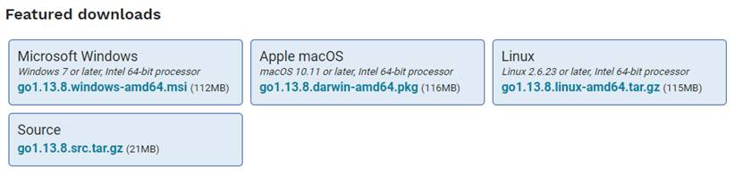
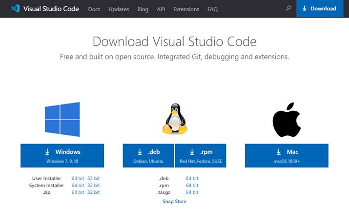
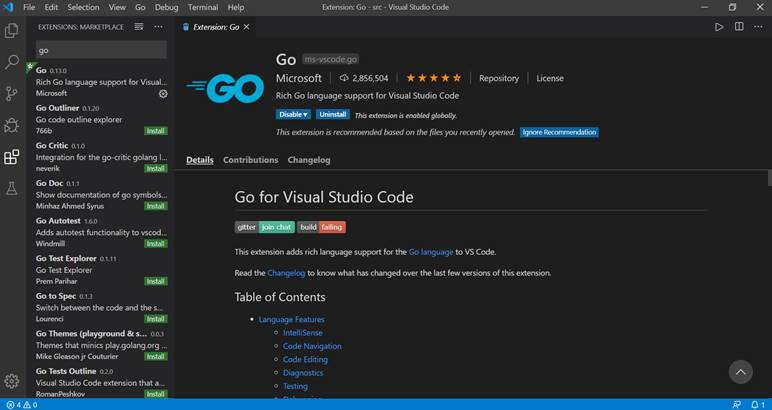
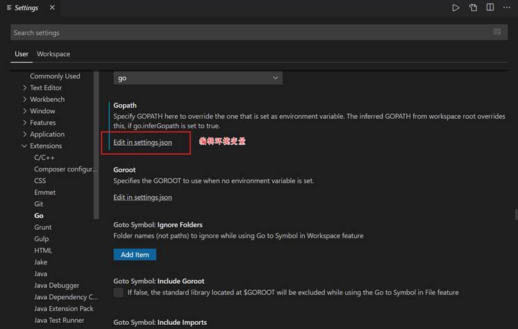
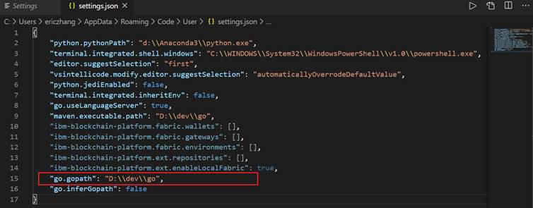
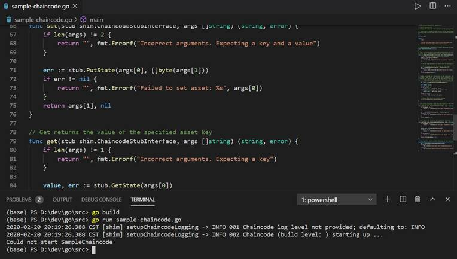

## 开发环境

### Go语言的安装
官方文档：https://golang.google.cn/

Go语言提供windwos、linux、mac下载安装。大家根据自己的机器环境选择安装。

<div align=center>


 

5-01_01 Golang下载
</div>

Windows下安装Go语言非常方便，根据向导一步一步操作即可。

### Visual Studio Code的安装与配置

官方文档：https://code.visualstudio.com/

VS code提供windwos、linux、mac下载安装。大家根据自己的机器环境选择安装。以下以Win10为例。

**1. 安装VS Code**

<div align=center>


 

5-01_02 VS code下载
</div>

安装完成后，windows下使用快捷键win+R调出运行框，输入code，启动VS code编辑器。
   
**2. 安装go语言插件**

官方文档：https://code.visualstudio.com/docs/languages/go 

使用快捷键Ctrl+Shift+X调出扩展面板，输入Go for Visual Studio Code，安装Go语言插件。

<div align=center>


 

5-01_03 Go for Visual Studio Code下载
</div>

**3. 配置环境变量**

使用快捷键Ctrl+Shift+P调出命令面板，输入Go：Current GOPATH，可以查看当前Go的GOPATH环境变量。

当然也可以在File->Preferences->Settings->User->Extensions->Go菜单中设置Gopath。

选择编辑settings.json可以对环境变化进行设置。

<div align=center>


 

5-01_03 配置环境变量

 

5-01_04 配置环境变量
</div>

**4. 配置chaincode依赖包**

为了方便进行Chaincode开发，我们需要的安装两个依赖包，分别是：
"github.com/hyperledger/fabric/core/chaincode/shim"
"github.com/hyperledger/fabric/protos/peer"

Shim包为chaincode（链码）访问状态数据库、交易上下文和调用其他chaincode提供API。
通过以下命令安装两个依赖包，成功后这些库会被安装在GOPATH路径下。

```
go get github.com/hyperledger/fabric/protos/peer
go get github.com/hyperledger/fabric/core/chaincode/shim
```

当然你也可以使用Fabric源码，其中包含了以上两个依赖包。下载到$GOPATH/src/github.com/hyperledger目录下，本地开发的chaincode就可以正常工作了。

**5. 测试开发环境**

在GOPATH下新建一个chaincode（直接拷贝一个Fabric例子程序），执行以下命令：

```
go build
```
<div align=center>


 

5-01_05 编译链码
</div>

如果编译没有问题就代表环境安装成功。
