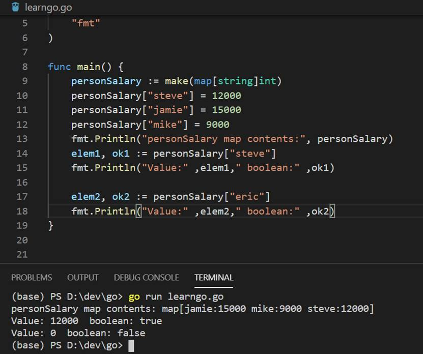

### 包
**1. Packages**

每个go程序都有一个包名。  
例如：
```
package main
```
**2. Imports**   
导入程序需要的包，以下是推荐方式。
```
import (
	"fmt"
	"math"
)
```
### 数据类型、变量和常量

**1. 数据类型（Types）**

下面是go语言常见的一些数据类型。

bool 布尔类型  
Numeric Types 数字类型
* int8, int16, int32, int64, int
* uint8, uint16, uint32, uint64, uint
* float32, float64

string 字符串

**2.变量声明**

在函数里，我们可以使用:=方式进行变量赋值。
```
var i, j int = 1, 2
k := 3
```

**3.常量（Constants）**

常量声明类始于变量声明，但需要加上const 关键字。
常量可以是character, string, boolean或者numeric。
不能使用 := 语法进行常量赋值。
```
const World = "世界"
const Truth = true
```

### 复杂数据类型（Array、Slices、Structs和Maps）

**1.Arrays**

数组 [n]T代表有n个值的T 数据类型的数组。数组的长度无法改变。
```
var a [3]int //int array with length 3
a := [3]int{12, 78, 50} // short hand declaration to create array
```
数组长度是将数组作为len函数的参数。
```
package main

import "fmt"

func main() {  
    a := [...]float64{67.7, 89.8, 21, 78}
    fmt.Println("length of a is",len(a))
}
```
**2.Slices**

数组一个固定长度的数组，而Slices是一个动态数组。实践中Slices比数组更常用。

```
s := []int{2, 3, 5, 7, 11, 13}
```
Slices有长度length和容量capacity两个函数。length是slices里包含的元素数量，capacity是slices的容量。

```
package main

import (  
    "fmt"
)

func main() {  
    fruitarray := [...]string{"apple", "orange", "grape", "mango", "water melon", "pine apple", "chikoo"}
    fruitslice := fruitarray[1:3]
    fmt.Printf("length of slice %d capacity %d", len(fruitslice), cap(fruitslice)) //length of fruitslice is 2 and capacity is 6
}
```
多维slices。如同数组一样，Slices可以包含任何类型，包含Slices。

```
package main

import (
	"fmt"
	"strings"
)

func main() {
	// Create a tic-tac-toe board.
	board := [][]string{
		[]string{"_", "_", "_"},
		[]string{"_", "_", "_"},
		[]string{"_", "_", "_"},
	}

	// The players take turns.
	board[0][0] = "X"
	board[2][2] = "O"
	board[1][2] = "X"
	board[1][0] = "O"
	board[0][2] = "X"

	for i := 0; i < len(board); i++ {
		fmt.Printf("%s\n", strings.Join(board[i], "  "))
	}
}
```
**3.structs**

**go语言没有提供类，使用structs来代表对象。Structs可以被用来存储一个对象，而不是维护一些单独的数据。**

```
type Employee struct {  
    firstName string
    lastName  string
    age       int
}
```
```
package main

import (  
    "fmt"
)

type Employee struct {  
    firstName, lastName string
    age, salary         int
}

func main() {

    //creating structure using field names
    emp1 := Employee{
        firstName: "Sam",
        age:       25,
        salary:    500,
        lastName:  "Anderson",
    }

    //creating structure without using field names
    emp2 := Employee{"Thomas", "Paul", 29, 800}

    fmt.Println("Employee 1", emp1)
    fmt.Println("Employee 2", emp2)
}
```
在上面的例子中，我们定义一个Employee结构体，使用两种方式进行赋值。第一种方式指定了结构体的字段名，因此不用考虑顺序；第二方式忽略了结构体的字段名，这种情况下一定要按照字段顺序进行赋值。

匿名结构体。在匿名结构体中只是创建了一个emp3的结构体，但是没有定义一个新的结构体类型。

```
package main

import (  
    "fmt"
)

func main() {  
    emp3 := struct {
        firstName, lastName string
        age, salary         int
    }{
        firstName: "Andreah",
        lastName:  "Nikola",
        age:       31,
        salary:    5000,
    }

    fmt.Println("Employee 3", emp3)
}
```

**4.Maps**

Map包含了健值对，可以通过key获取对应的value。

```
type Vertex struct {
	Lat, Long float64
}

var m = map[string]Vertex{
	"Bell Labs": {40.68433, -74.39967},
	"Google":    {37.42202, -122.08408},
}
```
使用make创建map。
```
package main

import (  
    "fmt"
)

func main() {  
    personSalary := make(map[string]int)
    personSalary["steve"] = 12000
    personSalary["jamie"] = 15000
    personSalary["mike"] = 9000
    fmt.Println("personSalary map contents:", personSalary)

    elem1, ok1 := personSalary["steve"]
    fmt.Println("Value:" ,elem1," boolean:" ,ok1)

    elem2, ok2 := personSalary["eric"]
    fmt.Println("Value:" ,elem2," boolean:" ,ok2)
}
```
当key存在于map中时， personSalary["steve"]返回的是对应的值和true，当key不存在时，personSalary["eric"]返回的是0和false。

<div align=center>


 

5-02_01 Map
</div>