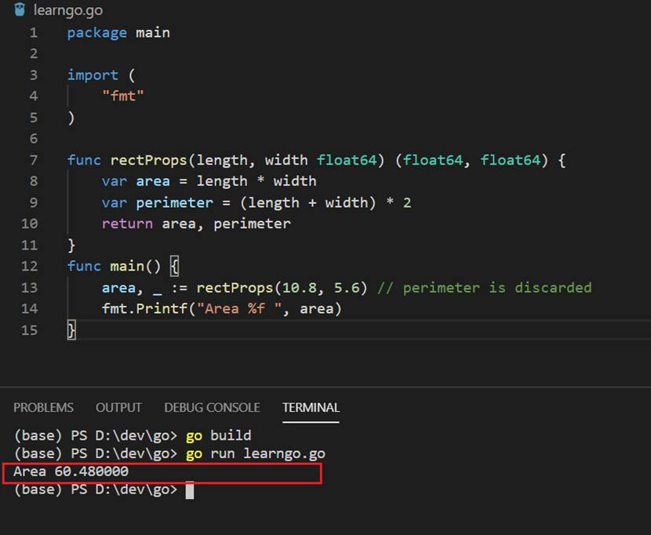
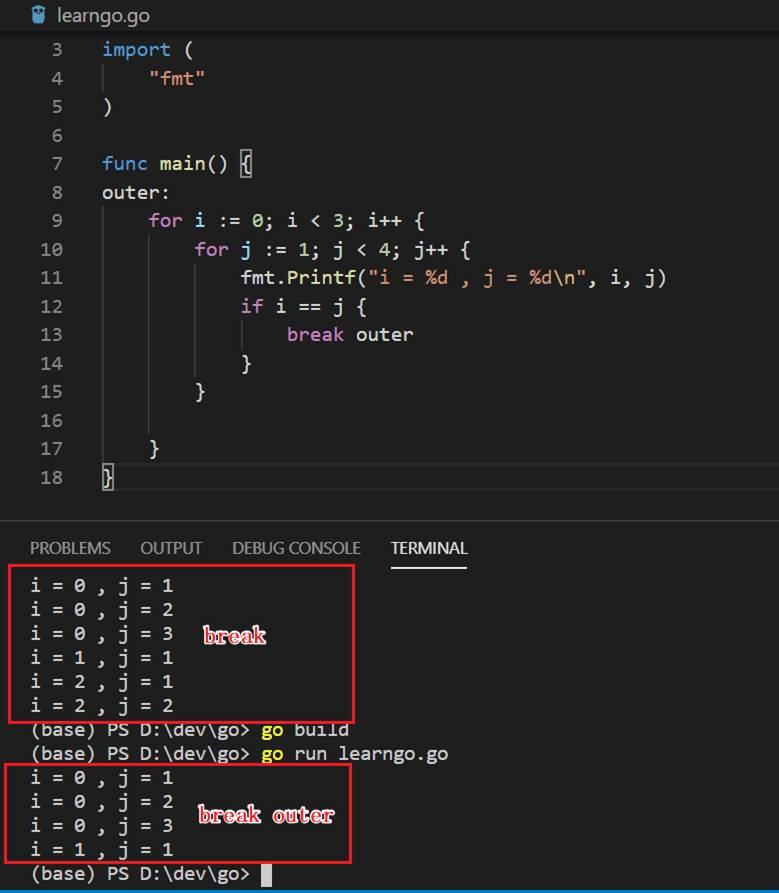

### 函数
**1.函数（Fucnciton）**

Go函数是一段用来执行特定任务的代码块，语法如下：
以func开始，可以有多个参数，返回值位于参数之后。

```
func functionname(parametername type) returntype {  
 //function body
}
```
返回值和参数在函数中是可选的。下面的语法也是正确的。
```
func functionname() {  
}
```
以下是一个完整的函数：
```
package main

import (  
    "fmt"
)

func calculateBill(price, no int) int {  
    var totalPrice = price * no
    return totalPrice
}
func main() {  
    price, no := 90, 6
    totalPrice := calculateBill(price, no)
    fmt.Println("Total price is", totalPrice)
}
```
**2.多个返回值**

与Java等语言不一样的是Go函数可以有多个返回结果。
```
package main

import (  
    "fmt"
)

func rectProps(length, width float64)(float64, float64) {  
    var area = length * width
    var perimeter = (length + width) * 2
    return area, perimeter
}

func main() {  
     area, perimeter := rectProps(10.8, 5.6)
     fmt.Printf("Area %f Perimeter %f", area, perimeter) 
}
```
**3.空格标识符**
```
package main

import (  
    "fmt"
)

func rectProps(length, width float64) (float64, float64) {  
    var area = length * width
    var perimeter = (length + width) * 2
    return area, perimeter
}
func main() {  
    area, _ := rectProps(10.8, 5.6) // perimeter is discarded
    fmt.Printf("Area %f ", area)
}

```
从下图可以看出，使用_空白标识符可以放弃接收第二个返回值。
<div align=center>


 

5-02_02 空白标识符
</div>

### 流程控制（Flow control）

**1.For**

Go只有一个循环结构——for。  
与Java等语言不一样的是for的声明语句不需要小括号（）。
```
	for i := 1; i <= 100; i++ {
		sum += i
	}
```
初始化和递增声明是可选的。
```
	for ; sum < 1000; {
		sum += sum
	}
```
For语句还可以类似Java里while。
```
	sum := 1
	for sum < 1000 {
		sum += sum
	}
```
**2.If**
Go的if声明语句类似循环语句，表达式不需要使用小括号（），但是执行语句中的大括号{}是需要的。

```
	if x < 0 {
		return sqrt(-x) + "i"
	}
```

**3.Break**
结束循环。
```
package main

import (  
    "fmt"
)

func main() {  
    for i := 0; i < 3; i++ {
        for j := 1; j < 4; j++ {
            fmt.Printf("i = %d , j = %d\n", i, j)
            if i == j {
                break
            }
        }

    }
}
```

**4.Continue**

跳过当前语句，继续执行循环语句。
```
package main

import (  
    "fmt"
)

func main() {  
    for i := 1; i <= 10; i++ {
        if i%2 == 0 {
            continue
        }
        fmt.Printf("%d ", i)
    }
}
```

**5.标签**

break使用标签（labels），跳出当前标签循环。
```
package main

import (  
    "fmt"
)

func main() {  
outer:  
    for i := 0; i < 3; i++ {
        for j := 1; j < 4; j++ {
            fmt.Printf("i = %d , j = %d\n", i, j)
            if i == j {
                break outer
            }
        }

    }
}
```
运行效果如下图，可以看出break只是跳出当前循环，但使用break加outer标签直接可以退出标签所在循环，实在是很方便。

<div align=center>


 

5-02_03 标签
</div>

### 方法（Method）

Go没有类，然而我们可以为任意数据类型定义方法。

为数据类型定义方法（Method）的方式是在func和方法之间增加一个特别的接受参数。

下面的例子中，Abs方法有一个Vertex类型的接受参数ver。

```
package main

import (
	"fmt"
	"math"
)

type Vertex struct {
	X, Y float64
}

//在func和Abs()方法之间有一个Vertex类型的接受参数ver
func (ver Vertex) Abs() float64 {
	return math.Sqrt(ver.X*ver.X + ver.Y*ver.Y)
}
//在func和Add()方法之间有一个Vertex类型的接受参数ver
func (ver Vertex) Add() float64{
	return ver.X+ver.Y
}
//在func和Divide ()方法之间有一个Vertex类型的接受参数ver
func (ver Vertex) Divide() float64{
	return ver.X/ver.Y
}

func main() {
	ver := Vertex{3, 4}
	fmt.Println(ver.Abs())
	fmt.Println(ver.Add())
	fmt.Println(ver.Divide())
}
```