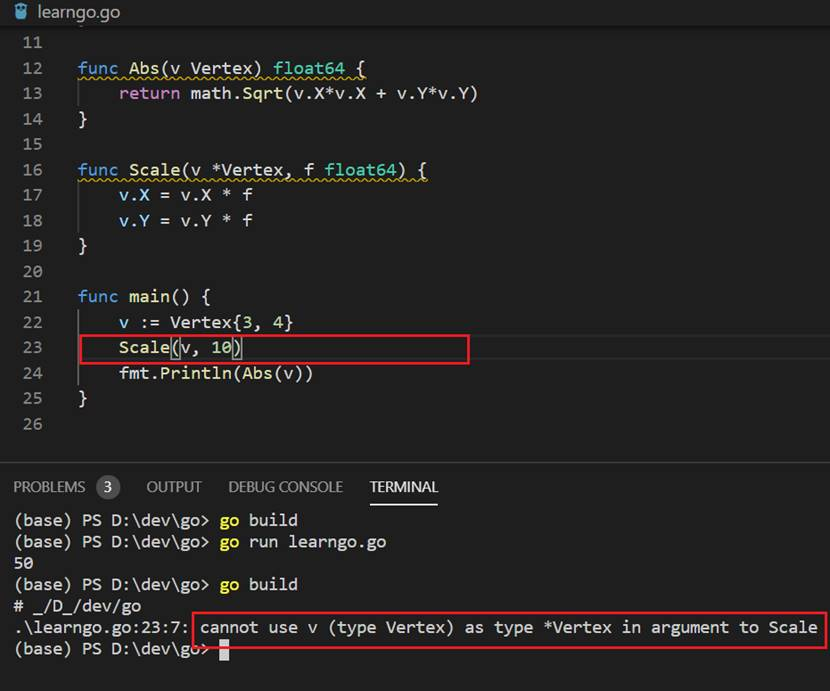

### 指针接收器（Pointer receivers）
上面例子定义方法的时候我们使用的是值接收器（ value receiver）。下面我学习一下使用指针接收器（ pointer receiver）定义方法，并琢磨一下两者之间有什么区别。

下面的例子使用了指针接收器（ pointer receiver）定义方法。在定义Vertex 的Scale()方法时，传递了一个指针接收器*Vertex。

```
package main

import (
	"fmt"
	"math"
)

type Vertex struct {
	X, Y float64
}
//传递了值接收器Vertex
func (v Vertex) Abs() float64 {
	return math.Sqrt(v.X*v.X + v.Y*v.Y)
}
//传递了指针接收器*Vertex
func (v *Vertex) Scale(f float64) {
	v.X = v.X * f
	v.Y = v.Y * f
}

func main() {
	v := Vertex{3, 4}
 //在调用指针接收器方法时使用了v，而没有采用&v
//这是因为在使用指针接收器作为参数时，go语言会默认会将
//v.Scale(10)看做&v.Scale(10)
	v.Scale(10)
	fmt.Println(v.Abs())
}
```
接下来我们把Scale()方法的指针接收器*Vertex修改为值接收器Vertex，看看与指针接收器有什么差别。

<div align=center>


 

5-02_04 值接收器与指针接收器的差别
</div>

从上图中我可以看出，使用指针接收器调用Scale()方法时，指针接收器修改了Vertex的值，使得Vertex在调用Abs()方法时X、Y都增加了10倍，因此调用Abs()方法得到的结果是50。

接下来，采用了值接收器后，Vertex同样还是调用了Scale()方法，但是只是对Vertex的拷贝进行操作，因此调用Abs()方法时结果还是Vertex初始值运算结果5。

**注意：在定义方法时，虽然v.Scale(10)的v传递的值，而非指针，但Go解释器会自动将v.Scale(10)看做&v.Scale(10)。**

下面是采用函数的方式实现以上功能。看看函数与指针接收器的方法有啥区别。

```
package main

import (
	"fmt"
	"math"
)

type Vertex struct {
	X, Y float64
}

func Abs(v Vertex) float64 {
	return math.Sqrt(v.X*v.X + v.Y*v.Y)
}

func Scale(v *Vertex, f float64) {
	v.X = v.X * f
	v.Y = v.Y * f
}

func main() {
	v := Vertex{3, 4}
 //函数调用时，传递的参数必须与函数定义的类型一致
	Scale(&v, 10)
	fmt.Println(Abs(v))
}
```
采用函数的方式实现上面的功能，传递的参数就必须与函数定义的类型一致，否则会出现下图中的编译错误。

<div align=center>


 

5-02_05 函数的实现方式
</div>

### 接口（Interface）

在面向对象语言中，接口定义了对象的行为。换句话来说，接口只是定义了对象打算做的事情，但没有具体的实现。

在Go语言中，接口是一套空方法。当一个数据类型提供了接口中定义的所有方法，也就意味着该数据类型实现了接口。这种方式类似于面向对象中的设计，但没有implements关键字，也就是常说的“隐式继承”。Go的设计解耦了接口定义和具体实现，相比Java的强耦合继承关系，更加容易使用且通用性强。

```
package main

import "fmt"

type I interface {
	M()
}

type T struct {
	S string
}

type MyFloat float64

// 这个方法说明type T实现了接口I，
// 但是我们不需要显式声明
func (t T) M() {
	fmt.Println(t.S)
}
// 这个方法说明float64 MyFloat实现了接口I，
// 但是我们不需要显式声明

func (f MyFloat) M() {
	fmt.Println(f)
}

func main() {
	var i I = T{"hello"}
	i.M()
	
	var f I = MyFloat(2)
	f.M()
}
```
以下是Java的接口实现方式，类必须使用implements关键字进行接口实现，而且类与接口之间是强耦合。

```
import java.io.IOException;
interface Shape {
  void draw(double amount) throws IOException;
}
class Main implements Shape{

  @Override
  public void draw(double amount) {
    // TODO Auto-generated method stub
  }  
}
```


