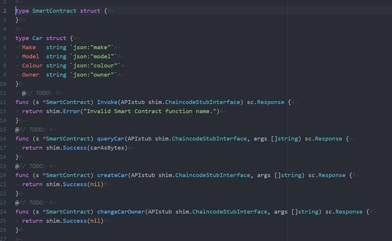
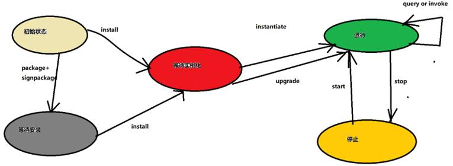

## 链码基本概念

智能合约（smart contract）本质上是一段运行在区块链网络上的业务逻辑代码。

绝大多数的区块链都要求采用共识机制验证、排序并将交易广播到所有节点，然后每个节点按照顺序执行交易。

运行在区块链上智能合约必须是一些确定性的业务逻辑。如果运行一些随机性较强的业务，由于每个节点的运行结果不一致，这样就无法达成共识。进一步来讲，由于智能合约运行在每个节点上，每个节点要按顺序执行交易，整个网络要对交易进行并行计算，这就牺牲了程序的效率，但同时可保证代码的安全性。

Fabric在设计上解耦了排序节点（Orderer）、背书节点（ Endorser ）、确认节点（ Committer ），并将交易流程分为背书节点进行交易验证及模拟执行，Orderer节点进行交易排序并生成区块，以及Commiter节点验证交易并将区块写入账本，解决了传统区块链面临的扩展性、灵活性、性能及机密性挑战问题。

在Fabric中，可以根据业务需要进行背书策略设置，选择采用哪些节点进行智能合约的执行。这样做的好处是，交易只需要执行在背书策略设定的节点上，这样就允许并行执行提高网络的整体性能。同时这种方式也可以在排序之前过滤掉不确定业务逻辑，消除了合约不确定性。

以太坊虚拟机（EVM）是以太坊智能合约的运行环境。它不仅被沙盒封装起来，事实上它被完全隔离，也就是说运行在EVM内部的代码不能接触到网络、文件系统或者其它进程，甚至智能合约之间也只有有限的调用。EOS虚拟机采用的WebAssembly（WASM）是一个内存安全的沙盒执行环境虚拟机，为智能合约提供了安全保障。Fabric使用了Docker来存放链上的代码，而不需要依靠特定的虚拟机，Docker为链码执行提供了一个安全、轻便的语言执行环境。

### 智能合约与Chaincode

从应用开发者视角来看，智能合约（Smart Contract）经常与账本（Ledger）联系在一起，账本保存了业务对象当前状态和历史状态。

在Fabric中经常会用到智能合约和链码两个术语。智能合约定义了业务资产和不同组织的业务逻辑，是区块链应用的核心业务逻辑。与智能合约对应的是链码，一个链码里可以包含多个智能合约。智能合约负责业务逻辑，而链码负责的是怎样将智能合约进行打包、部署。

通常情况下，系统管理员关注的是链码，业务人员和开发人员关注的是智能合约。

举个车辆买卖的例子。在车辆买卖业务中，假设有销售方和购买方两个组织，使用智能合约实现车辆销售的业务逻辑。一旦销售方将车辆按照指定时间交付，购买方就根据之前车辆购买合同中的约定自动进行付款，通过智能合约可以大幅度提高业务执行效率。

 

5-03_01 智能合约

上图中定义了车辆的智能合约。智能合约中定义了车辆资产（Car结构体）和销售方和购买方的相关业务逻辑（queryCar、createCar和changeCar等相关方法）。当应用调用Invoke方法时就会执行相应业务逻辑，进而生成交易数据存储在账本里。

### 链码的生命周期

链码（chaincode）使用gRPC协议通过Peer节点操作分布式账本中的数据。Fabric网络启动后，可以通过命令行或SDK进行链码操作，验证网络是否正常运行。

用户可以通过命令行方式操作链码，支持的链码子命令包括install 、instantiate 、invoke 、query、upgrade 、package 和signpackage 等，大部分命令（除了package 、signpackage）的处理过程都是类似的，先创建签名提案消息，再发给Peer 进行背书，获取ProposalResponse 消息。

需要注意的是， instantiate 、upgrade 和invoke 等子命令还需要根据ProposalResponse 消息创建SignedTX ， 发送给Orderer 进行排序和广播全网执行。package、signpackage 子命令作为本地操作，无需与Peer 或Orderer 打交道。

链码生命周期，包括初始状态，等待安装、等待实例化、运行和停止。

 

5-03_02 链码生命周期

**peer chaincode install**

将链码打包成可部署格式，并存入到背书节点的文件系统。

**peer chaincode instantiate**

把安装到背书节点上的链码实例化到指定通道，该命令会在节点上创建运行链码的docker容器，并初始化链码。

**peer chaincode invoke**

调用指定链码。

**peer chaincode query**

查询指定链码，该命令只查询节点上状态，不生成区块。 

**peer chaincode package**

将链码打包为可部署格式 

**peer chaincode signpackage**

签名打包后的链码 

**peer chaincode upgrade**

升级链码，需要先用peer chaincode install命令安装更新代码，然后使用该命令来升级已经实例化的代码。

