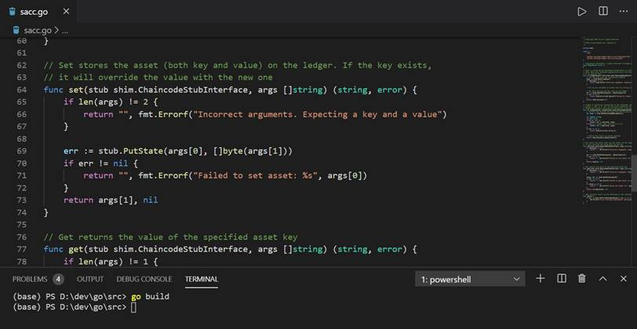

## 链码开发
### 理解链码程序
Fabric提供了ChaincodeStubInterface接口供开发者进行程序智能合约开发，你可以使用接口进行账本查询、更新和删除操作。主要API如下：

1. func (stub *ChaincodeStub) GetState(key string) ([]byte, error) 
   
GetState是根据key返回交易信息，当交易信息不存在时返回(nil, nil)。

2. func (stub *ChaincodeStub) PutState(key string, value []byte) error

PutState方法是将key和value信息写到一个 data-write提议中，当该笔交易被背书节点验证通过并成功提交后才正式生效。

3. func (stub *ChaincodeStub) DelState(key string) error

DelState方法是根据key删除账本中的记录，当该笔删除操作被节点验证和成功提交后才会生效。需要注意的是虽然键值从账本中删除，但删除操作的交易记录会保存在区块中。

编写chaincode时需要实现两个方法，分别是：

1. Init

当调用instantiate或者upgrade方式时，该方法才会被调用。

2. Invoke

当处理一个事务提议时该方法被调用。

作为一个开发者你必须在 chaincode中创建Init和Invoke方法。一个chaincode必须使用peer chaincode install和peer chaincode instantiate命令之后才可以使用peer chaincode invoke和peer chaincode query方法。


### 链码开发详解

下面我们通过一个例子来具体学习一下chaincode的编写 。  
打开我们前面已经配置好的VScode，新建一个sacc.go文件。

**1. 导入资源包**

首先导入fmt、shim、protos包。 

Chaincode接口定义了Init和Invoke函数，Shim包定义了Success、Error等常用方法，shim包的ChaincodeStubInterface接口提供了一组方法，通过该组方法可以非常方便的操作账本数据。protos是Google提供的数据序列号协议，用来将给客户端发送的消息进行序列化。

详细说明请参照官方文档：
https://pkg.go.dev/github.com/hyperledger/fabric/core/chaincode/shim?tab=doc#ChaincodeStubInterface
https://pkg.go.dev/github.com/hyperledger/fabric/protos/peer?tab=doc

接下来定义了一个SimpleAsset 作为链码方法的接收参数。

```
package main

import (
    "fmt"

    "github.com/hyperledger/fabric/core/chaincode/shim"
    "github.com/hyperledger/fabric/protos/peer"
)

// 定义一个SimpleAsset结构体用来管理资产。
SimpleAsset implements a simple chaincode to manage an asset
type SimpleAsset struct {
}
```
**2.init链码**

链码实例化和升级的时候都会调用init方法。

链码初始化的时候，调用了ChaincodeStubInterface.GetStringArgs 函数检查参数的合法性。这个例子中，我们期望传入一个key/value对。接下来，将key/value作为 ChaincodeStubInterface.PutState 的参数，如果shim向客户端返回正确消息表明初始化成功。

```
//链码实例化和升级的时候都会调用init方法。
func (t *SimpleAsset) Init(stub shim.ChaincodeStubInterface) peer.Response {
  // Get the args from the transaction proposal
  args := stub.GetStringArgs()
  if len(args) != 2 {
    return shim.Error("Incorrect arguments. Expecting a key and a value")
  }
}

//将key/value存入账本
  err := stub.PutState(args[0], []byte(args[1]))
  if err != nil {
    return shim.Error(fmt.Sprintf("Failed to create asset: %s", args[0]))
  }
  return shim.Success(nil)
}
```

**3.Invoke链码**

当客户端与链码交互时会调用invoke方法。在这个例子中，只有set和get两个方法。set方法是用来为资产赋值，get方法是用来查询资产余额。

首先我们调用ChaincodeStubInterface.GetFunctionAndParameters获得函数名和参数，接着根据set或者get来验证函数名，调用相应的方法，通过shim.Success 或者 shim.Error返回相应的结果。

```
//每个交易都会调用invoke方法。每个交易都有一个set和get方法，可以在初始化的时候//为资产赋值，也可以使用set方法为资产赋值。
func (t *SimpleAsset) Invoke(stub shim.ChaincodeStubInterface) peer.Response {
    // 从交易提议中获取函数名和参数
    fn, args := stub.GetFunctionAndParameters()

    var result string
    var err error
    if fn == "set" {
            result, err = set(stub, args)
    } else { // 即使函数名是nil也认为是get
            result, err = get(stub, args)
    }
    if err != nil {
            return shim.Error(err.Error())
    }

    // 返回成功结果
    return shim.Success([]byte(result))
}
```

**4.实现方法**

在inovke方法里，我们调用了set和get两个函数，下面来具体实现。

要访问账本需要用到Shim API里的ChaincodeStubInterface.PutState 和ChaincodeStubInterface.GetState。

```
//将资产存储在账本里
func set(stub shim.ChaincodeStubInterface, args []string) (string, error) {
    if len(args) != 2 {
            return "", fmt.Errorf("Incorrect arguments. Expecting a key and a value")
    }

    err := stub.PutState(args[0], []byte(args[1]))
    if err != nil {
            return "", fmt.Errorf("Failed to set asset: %s", args[0])
    }
    return args[1], nil
}

// 根据资产名称获取资产余额
func get(stub shim.ChaincodeStubInterface, args []string) (string, error) {
    if len(args) != 1 {
            return "", fmt.Errorf("Incorrect arguments. Expecting a key")
    }

    value, err := stub.GetState(args[0])
    if err != nil {
            return "", fmt.Errorf("Failed to get asset: %s with error: %s", args[0], err)
    }
    if value == nil {
            return "", fmt.Errorf("Asset not found: %s", args[0])
    }
    return string(value), nil
}
```
**5.添加main函数**

添加main函数。Main函数用来调用Start函数启动SimpleAsset链码。需要注意的是只有在链码实例化时main函数才会被调用。

```
//实例化时，在容器中启动main函数
func main() {
    if err := shim.Start(new(SimpleAsset)); err != nil {
            fmt.Printf("Error starting SimpleAsset chaincode: %s", err)
    }
}
```
**6.编译程序**

检查以上5步代码无误后，在命令行下编译chaincode。

```
go build
```
<div align=center>


 

5-04 编译链码
</div>

如果编译没有问题就可以进行链码测试了。
