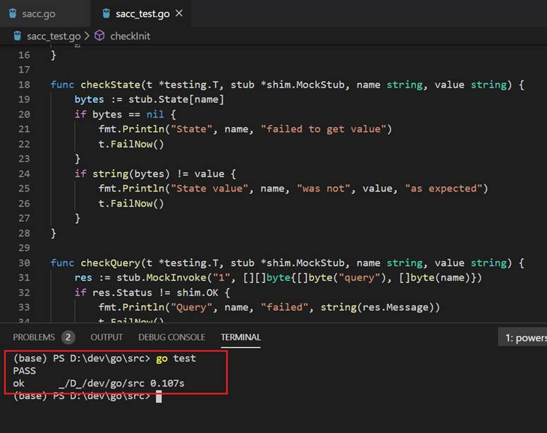

## 单元测试

Go语言提供了MockStub类型用于单元测试，可以使用“go test”命令，或者通过VS code进行单元测试。

单元测试的好处是不用启动Fabric网络即可在本地开发环境下进行链码的测试。

其原理是维护了一个 map[string][]byte类型的State用来模拟账本状态数据库，对链码的操作PutState()、GetState()、DelState()方法都是针对与内存中的State。MockStub主要提供了MockInit()、MockInvoke()方法模拟背书节点对链码的调用。

编写测试用例时，文件必须以_test.go结尾，包含TestXxx函数（Xxx首字母必须是大写），并与链码位于同一包路径下。编写链码测试用例可以直接参考官方提供的例子程序：github.com\hyperledger\fabric\examples\chaincode\go\example02\chaincode_test.go

为了方便测试用例编写，这里提供了一些常用的测试方法：

* checkInit
* checkState
* checkQuery
* checkInvoke

sacc_test.go测试用例如下：

```
package main

import (
    "fmt"
    "testing"

    "github.com/hyperledger/fabric/core/chaincode/shim"
)

func checkInit(t *testing.T, stub *shim.MockStub, args [][]byte) {
    res := stub.MockInit("1", args)
    if res.Status != shim.OK {
        fmt.Println("Init failed", string(res.Message))
        t.FailNow()
    }
}

func checkState(t *testing.T, stub *shim.MockStub, name string, value string) {
    bytes := stub.State[name]
    if bytes == nil {
        fmt.Println("State", name, "failed to get value")
        t.FailNow()
    }
    if string(bytes) != value {
        fmt.Println("State value", name, "was not", value, "as expected")
        t.FailNow()
    }
}

func checkQuery(t *testing.T, stub *shim.MockStub, name string, value string) {
    res := stub.MockInvoke("1", [][]byte{[]byte("query"), []byte(name)})
    if res.Status != shim.OK {
        fmt.Println("Query", name, "failed", string(res.Message))
        t.FailNow()
    }
    if res.Payload == nil {
        fmt.Println("Query", name, "failed to get value")
        t.FailNow()
    }
    if string(res.Payload) != value {
        fmt.Println("Query value", name, "was not", value, "as expected")
        t.FailNow()
    }
}

func checkInvoke(t *testing.T, stub *shim.MockStub, args [][]byte) {
    res := stub.MockInvoke("1", args)
    if res.Status != shim.OK {
        fmt.Println("Invoke", args, "failed", string(res.Message))
        t.FailNow()
    }
}

func TestSacc_Init(t *testing.T) {
    cc := new(SimpleAsset)
    stub := shim.NewMockStub("sacc", cc)

    // Init a=100
    checkInit(t, stub, [][]byte{[]byte("a"), []byte("100")})
    // check a=100
    checkState(t, stub, "a", "100")

}

func TestSacc_Query(t *testing.T) {
    cc := new(SimpleAsset)
    stub := shim.NewMockStub("sacc", cc)

    // Init a=100
    checkInit(t, stub, [][]byte{[]byte("a"), []byte("100")})
    // Init b=100
    checkInit(t, stub, [][]byte{[]byte("b"), []byte("100")})
    // check a=100
    checkQuery(t, stub, "a", "100")
    // check b=100
    checkQuery(t, stub, "b", "100")

}

func TestSacc_Invoke(t *testing.T) {
    cc := new(SimpleAsset)
    stub := shim.NewMockStub("sacc", cc)

    // Init a=100
    checkInit(t, stub, [][]byte{[]byte("a"), []byte("100")})
    // Init b=100
    checkInit(t, stub, [][]byte{[]byte("b"), []byte("100")})

    checkQuery(t, stub, "a", "100")
    checkQuery(t, stub, "b", "100")

    // set a=10
    checkInvoke(t, stub, [][]byte{[]byte("set"), []byte("a"), []byte("10")})
    // set b=90
    checkInvoke(t, stub, [][]byte{[]byte("set"), []byte("b"), []byte("90")})

    checkQuery(t, stub, "a", "10")
    checkQuery(t, stub, "b", "90")
}
```
在命令行执行go test，结果如下：

<div align=center>


 

5-05 单元测试
</div>

VS code提供run package tests、 run file tests 、run test、 debug test方式进行单元测试。

**注意：完成链码单元测试后，我们还可以在Fabric的开发环境进行进一步测试。Fabric的开发环境位于fabric-samples目录下的chaincode-docker-devmode下。**

具体测试步骤可以参照官方文档说明：

https://hyperledger-fabric.readthedocs.io/en/release-1.4/chaincode4ade.html#testing-using-dev-mode


