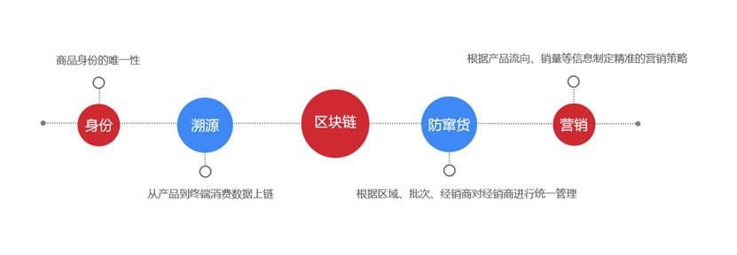
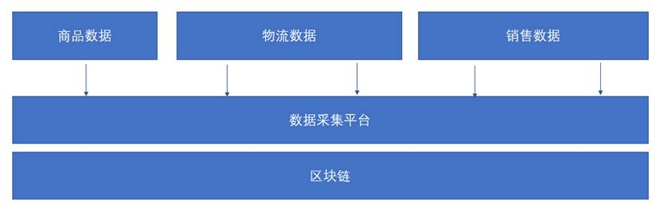
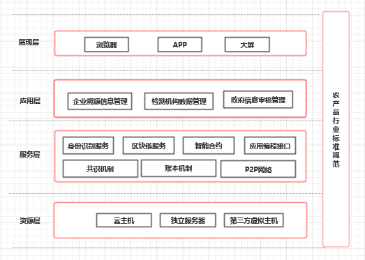

## 区块链农产品溯源方案设计
### 项目背景
农产品质量安全就是指农产品的可靠性、使用性和内在价值，包括在生产、贮存、流通和使用过程中形成、残存的营养、危害及外在特征因子，既有等级、规格、品质等特性要求，也有对人、环境的危害等级水平的要求。

农产品的质量安全问题一直是消费者、政府及社会各界关注的重点。2006年4月我国颁布了《中华人民共和国农产品质量安全法》，从我国农业生产的实际出发，针对保障农产品质量安全，规定了管理体制、质量安全要求、强制实施制度以及农产品产地、农产品生产、农产品包装和标识、监督检查及责任追究制度。 

2019年中央一号文件连续第16年聚焦“三农”，提出完成高标准农田建设任务，调整优化农业结构，实施重要农产品保障战略。将稻谷、小麦作为必保品种，稳定玉米生产，确保谷物基本自给、口粮绝对安全。巩固棉花、油料、糖料、天然橡胶生产能力。主动扩大国内紧缺农产品进口，拓展多元化进口渠道。加大农产品反走私综合治理力度。完善农业支持保护制度。

2019年2月农业农村部办公厅印发了《2019年农产品质量安全工作要点》，文件指出：2019年是新中国成立70周年，是全面建成小康社会关键之年，做好农产品质量安全工作意义重大。各级农业农村部门要坚决贯彻落实习近平总书记“四个最严”指示要求，坚持以实施乡村振兴战略为总抓手，以深化农业供给侧结构性改革为主线，以增加绿色优质农产品供给为主攻方向，坚持“产出来”“管出来”两手抓，进一步推进质量兴农、绿色兴农、品牌强农，提升农产品质量安全水平，切实保障人民群众“舌尖上的安全”。

### 项目概述
中共中央政治局第十八次集体学习时提出：
>要探索“区块链+”在民生领域的运用，积极推动区块链技术在教育、就业、养老、精准脱贫、医疗健康、商品防伪、食品安全、公益、社会救助等领域的应用，为人民群众提供更加智能、更加便捷、更加优质的公共服务。”

区块链溯源被认为是继区块链金融之后最具潜力的区块链应用。区块链去中心化、不可篡改、可追溯的特点与溯源业务是绝对的天仙配。

传统溯源主要存在以下两个问题：
1. 数据中心化存储，由于各方利益考虑存在篡改数据的风险;
2. 溯源系统上企业各自记账，形成信息孤岛，数据无法溯源。

区块链溯源可以有效解决上面两个问题：
1. 基于区块链的哈希算法、共识机制，一旦数据上链，无法篡改；
2. 在不改变数据所有权的情况下，可以提高各方利益共享数据的积极性。

区块链技术拥有去中心化、数据不可篡改、可追溯等特性，成为继二维码、条形码等溯源技术的又一新的解决方案。

将区块链技术和物联网、二维码等技术相结合，将商品信息、物流信息、销售信息记录在链上，帮助企业有效解决商品溯源、防窜货等问题，制定精准的营销策略。

 

6-01-01 区块链溯源

区块链溯源上链信息的质量是关键。将商品信息、物流数据、销售信息记录在链上，区块链数据不可篡改的特点，可以有效保证上链的商品信息无法篡改，使得商品溯源的信任程度大幅度提升。

 

6-01-02 区块链溯源

### 项目目标
通过信息化手段提升农产品质量监管与服务水平，实现农产品质量管理“生产过程可记录、产品流向可跟踪、储运信息可查询、质量问题可追溯”的目标，集“管、防、控”功能于一体，确保“舌尖上的安全”，让社会群众买的放心、吃得安心。同时提升农业和农产品整体品牌形象，帮助企业打造强势品牌实现优质优价，促进地方农业发展，提升农业企业、合作社、农民的经济效益。

以二维码为产品溯源标识，利用区块链技术，通过其独特的不可篡改的分布式账本记录特性，对农产品生产到消费者进行全程可追溯，利用时间戳、共识机制等技术手段实现了数据的不可篡改和追本溯源等功能，给政府部门、农业企业、流通机构、服务机构的跨机构的溯源体系建立提供了技术支撑。同时把检测机构与消费者纳⼊监督体系中，打破了信息孤岛，提供了信息支持，在一定程度上实现农产品信息流转的透明度。

### 总体架构
技术上，农产品溯源会采用联盟链。在架构设计上，采用了可插拔、可扩展的系统框架；在节点的接入上，采用了授权管理的方式；在隐私保护上，采用了完备的权限和审查管理、细粒度隐私保护机制。由于农产品溯源链在设计上很好的使用了区块链分布式账本的特点和优势，因此农产品溯源在设计上体现了区块链多中心、公开透明、不可篡改、可追溯的特点，同时交易速度更快，具有更高的扩展性，并能很好的保护交易的隐私性。

 

6-01-03 总体架构

从技术角度来看，农产品溯源链是由资源层、服务层、应用层、展现层四部分组成。

资源层是是区块链系统正常运行所需的软硬件环境。

服务层包含区块链的底层协议和扩展服务。底层协议包含共识机制、账本以及网络，扩展服务包含了身份识别服务、区块链服务、智能合约及应用编程接口。

应用层是基于区块链技术开发的农产品溯源应用。农产品溯源应用系统可将农产品生产、加工、销售等过程的各种相关信息进行记录并存储在区块链上，能通过食品识别号在网络上对该产品进行查询认证，追溯其在各环节中的相关信息。

一个完整的区块链应用包含智能合约和WEB、APP系统，WEB、APP系统通过SDK与区块链进行交互。

### 效益与意义
农产品质量安全监管与溯源平台的建设，对于政府部门、农业企业、社会公众均有重要意义。

对于政府部门，溯源平台是提高农产品质量安全管理水平的重要抓手，促使农业生产规范化、标准化，打造区域农业品牌，面向社会提供了统一防伪溯源查验入口，并创新溯源产品保险承保机制，降低政府部门市场监管风险的同时，提升消费者对产品的认可度和认知度，提高政府的社会公信力。

对于农业企业，农产品溯源机制将倒逼企业加强食品安全生产管理，这是降低企业经营风险的根本保障，并有助于企业创建农产品品牌，让优质产品实现优价。溯源与保险的结合将提高企业对食品危机的风控水平。同时借助溯源平台对电子商务、实体门店信息、活动推广等资源整合，拉动产品市场销量。溯源平台云集众多优质企业，为跨业联盟与强强联合提供便利条件。

对于社会公众，全品类溯源监管体系的延伸将惠及全民，解决农业生产端与消费终端不对称的问题，溯源平台建设有效避免假冒伪劣商品进入正规渠道，消费者购买产品时可通过具有公信力的溯源服务平台进行查询，对出现问题的产品进行维权，合法权益将受到更好的保护。

### 行业案例
IBM、阿里、百度、京东、腾讯等国内外众多科技巨头都纷纷在区块链溯源方面积极布局跟进。

沃尔玛跟IBM合作，将食品供应链上的所有利益相关者组织起来协作，以期望达到食品安全的可追溯性，最重要的是向消费者展示全流程的透明度。

备受假货困扰的阿里巴巴，得益于集团多年的业务基础和数据积淀，商品溯源成为蚂蚁区块链最具优势的项目。

2017年3月，阿里与普华永道、新西兰邮政、恒天然合作，签署了全球跨境食品溯源的互信框架合作协议，应用“区块链”等创新技术，推动透明可追溯的跨境食品供应链。

2017年5 月，天猫国际启动全球溯源计划——利用区块链技术以及大数据跟踪进口商品全链路，在这个场景中，天猫针对来自澳洲、新西兰26个品牌商家、奶制品，基于蚂蚁区块链提供了关于每一瓶奶制品的身份证的溯源码服务。

2017年8月，天猫国际就已经全面启动全球溯源计划，利用区块链技术及大数据跟踪进口商品信息。

2018年2月，菜鸟和天猫国际达成合作，启用区块链技术建立商品的全链路物流信息。
需要注意的是，虽然区块链溯源有很多优势，但从实际业务来看，需要制定行业标准，对供应链系统进行改造，借助物联网技术进行数据采集避免源头造假。
