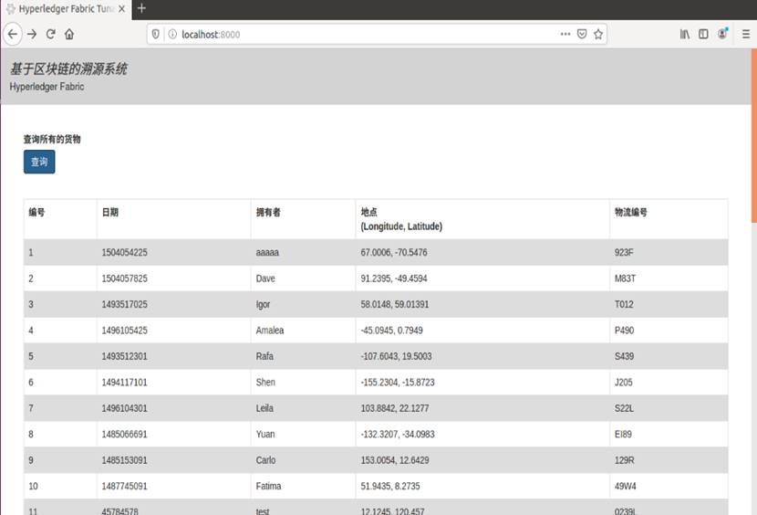
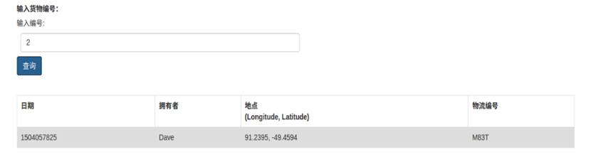
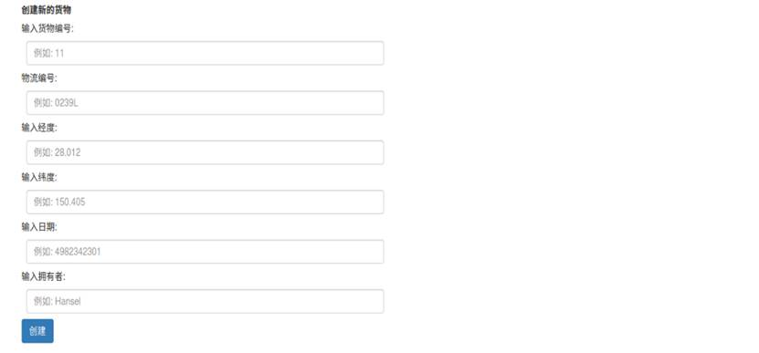
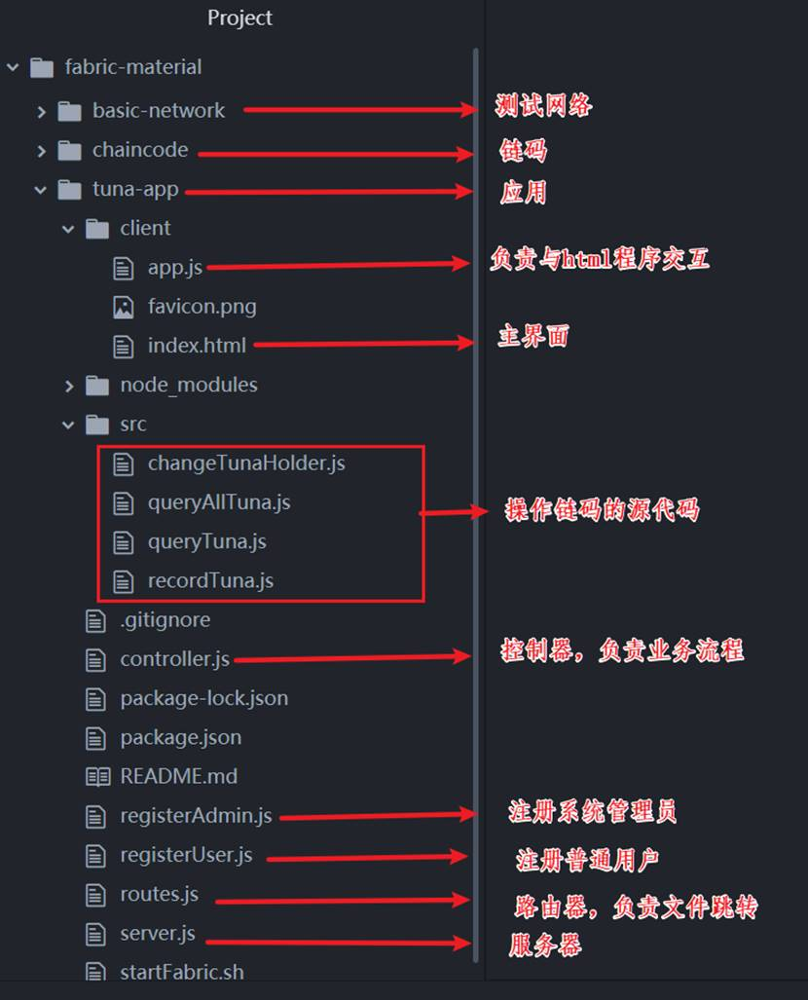

## 区块链应用开发

至此，我们已经完成了溯源业务的智能合约开发，接下来我们将基于Fabric Node.js SDK进行溯源应用的开发。

本章节我们会将前面学到理论知识融合到具体应用案例中。一起看看用户怎样通过应用查询、更新账本以实现与Fabric网络的交互。

应用程序通过SDK向区块链网络提交交易调用智能合约，背书节点在指定容器中运行智能合约（智能合约执行交易）；如果没有问题，应用程序在收到足够背书之后将交易发给Orderer节点；Orderer节点对交易请求进行打包然后广播给网络中其它节点；节点对交易进行最终检查，通过后写入账本。

### 系统原型
<div align=center>


 

6-06-01 系统原型

 

6-06-02 系统原型

 

6-06-03 系统原型
</div>

### 主要应用程序文件
<div align=center>


 

6-06-04 主要应用程序文件
</div>

完整的应用程序我已经放在了[源码目录](./src/fabric-material)下，下载完成后通过FTP工具上传到之前配置好的Ubuntu系统，执行以下命令：

1. 启动网络
```
#进入到程序目录
cd fabric-material/tuna-app
# 启动Fabric网络
./startFabric.sh
```

2. 安装Node.js相关依赖文件，按照以下顺序启动应用程序
```
# 按照node.js依赖文件
$ npm install
# 注册Admin
$ node registerAdmin.js
# 注册用户，用于系统的访问
$ node registerUser.js
# 启动应用程序
$ node server.js
```
3. 通过浏览器访问localhost:8000，即可访问。

### 主要应用逻辑

1. 设置Fabric网络
```
var Fabric_Client = require('fabric-client');
var path = require('path');
var util = require('util');
var os = require('os');

var fabric_client = new Fabric_Client();

// setup the fabric network
var channel = fabric_client.newChannel('mychannel');
var peer = fabric_client.newPeer('grpc://localhost:7051');
channel.addPeer(peer);
```
2. 获取用户证书
```
var member_user = null;
var store_path = path.join(os.homedir(), '.hfc-key-store');
console.log('Store path:'+store_path);
```
3. 查询所有
```
    // queryAllTuna - requires no arguments , ex: args: [''],
    const request = {
        chaincodeId: 'tuna-app',
        txId: tx_id,
        fcn: 'queryAllTuna',
        args: ['']
    };
```
4. 查询
```
    // queryTuna - requires 1 argument, ex: args: ['4'],
    const request = {
        chaincodeId: 'tuna-app',
        txId: tx_id,
        fcn: 'queryTuna',
        args: [key]
};
```
5. 增加
```
// recordTuna - requires 5 args, ID, vessel, location, timestamp,holder - ex: args: ['10', 'Hound', '-12.021, 28.012', '1504054225', 'Hansel'], 
    // send proposal to endorser
    const request = {
        //targets : --- letting this default to the peers assigned to the channel
        chaincodeId: 'tuna-app',
        fcn: 'recordTuna',
        args: [key, vessel, location, timestamp, holder],
        chainId: 'mychannel',
        txId: tx_id
};
```
6. 修改
```
// changeTunaHolder - requires 2 args , ex: args: ['1', 'Barry'],
    // send proposal to endorser
    var request = {
        //targets : --- letting this default to the peers assigned to the channel
        chaincodeId: 'tuna-app',
        fcn: 'changeTunaHolder',
        args: [key, holder],
        chainId: 'mychannel',
        txId: tx_id
};
```
**注意：以上应用程序包含了Fabric测试网络。学员也可以将链码和Node.js程序拷贝到之前我们已经配置好的Fabric网络进行测试。**