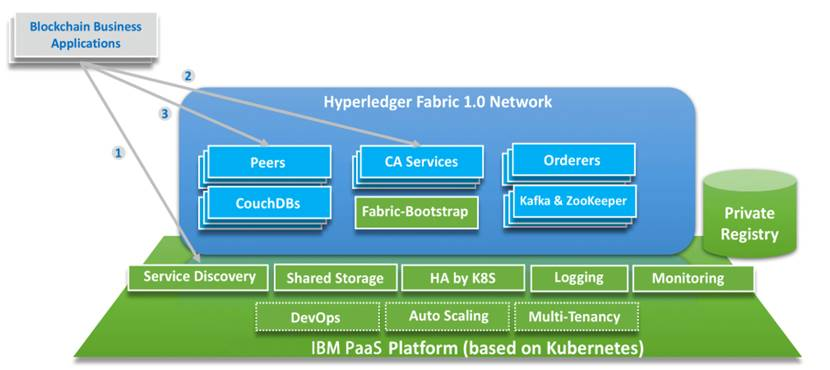

## IBM Bluemix 区块链平台

IBM区块链技术可通过Bluemix访问，该项技术基于Linux基金会的开源项目“超级账本”（Hyperledger），能够为用户提供一套开放的基础架构，帮助用户迅速构建与测试新的区块链应用及行业应用。

* 基于 Linux 基金会的开源项目 Hyperledger Fabric v1.0 和 IBM PaaS 云平台
* 提供端到端的区块链平台解决方案
* 快速搭建高可用的区块链网络
* 提供区块链平台安全特性
* 配备完整的自服务运维系统屏蔽 IT 的复杂度

### IBM 区块链即服务BaaS平台应用场景

**1. 企业需要开箱即用的区块链平台：**  

IBM BaaS 平台支持多租户场景，具备服务发现、共享存储、日志监控、DevOps 等企业级能力。

**2. 企业需要高可用和动态扩展的区块链网络底层框架：** 

IBM BaaS 平台集成 Kubernetes，支持 master 节点，共享存储，节点故障恢复，帮助应对高数据增长带来的挑战。

**3. 企业希望集中内部开发资源于上层业务应用，而非底层架构：**

IBM BaaS 平台提供 SDK、CLI 样例，供企业开发团队基于 IBM PaaS 云平台灵活快速配置区块链网络。

 

7-01 IBM Bluemix 区块链平台

### IBM 区块链即服务BaaS平台的优势

**1. 端到端的区块链解决方案**
  
* 保证区块链的底层网络和存储要求
* 可以提供区块链应用上线的自动化流程
* 对区块链提供全方位的运维管理
* 可与 P4、PureApp 进行集成

**2. 快速搭建高可用性区块链网路**
  
* 基于模板，快速自动化搭建
* 私有区块链镜像存储，版本一致稳定
* 无缝对接 IBM PaaS 云平台底层服务
* 节点故障可实现快速恢复
* 可定制区块链功能和拓扑结构

**3. 完整的自服务运维系统**
  
* IBM PaaS 云平台自运维具有独立的运维模型和相应的支撑组件
* 支持全景视图
* 全面监测 IT 问题，发现问题根源

如果对IBM区块链服务平台感兴趣，那就赶紧[注册](https://console.ng.bluemix.net/catalog/services/blockchain)试用吧。