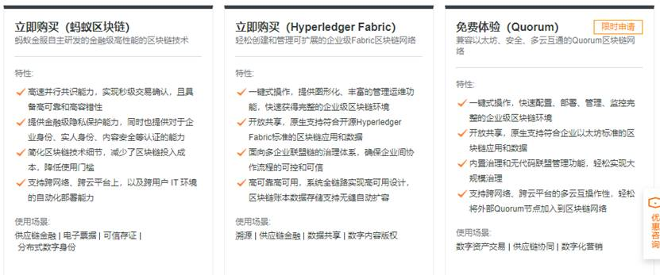

## 阿里云区块链平台

阿里云区块链服务（Blockchain as a Service，简称BaaS）是企业级区块链平台服务，支持Hyperledger Fabric、蚂蚁金服自研区块链技术、以及企业以太坊Quorum，为您构建更安全稳定的区块链环境，简化部署运维及开发流程，实现业务快速上链。

 

7-02 阿里云区块链平台

阿里云区块链平台的搭建非常方便，只需三步即可完成平台的搭建。大家可以参照[官方文档](https://help.aliyun.com/product/84950.html)进行[操作](https://baas.console.aliyun.com/)，开启你的区块链之旅吧！

