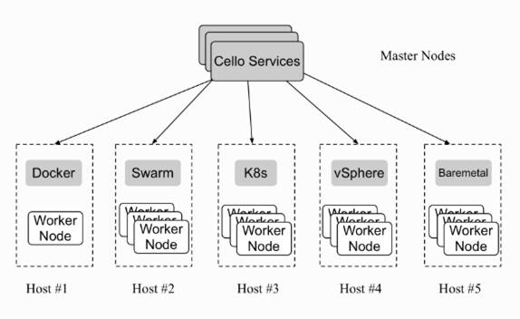
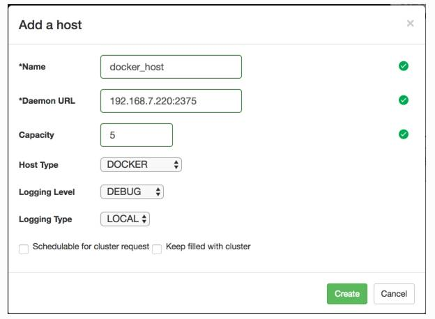
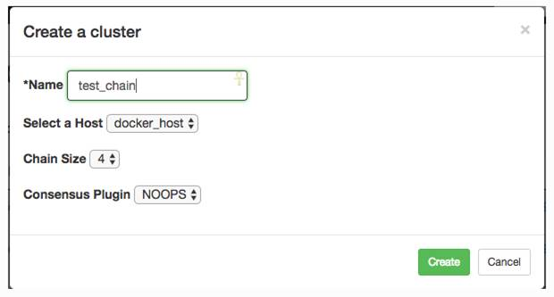
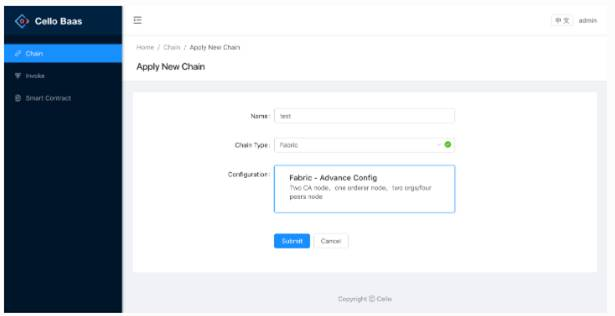
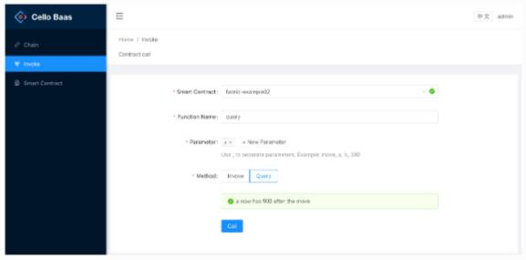

## 使用Cello搭建区块链平台

Hyperledger Cello 是超级账本项目下面的子项目，提供按需部署的功能，可以将区块链部署在各种裸机、虚拟机、容器等环境中。该项目最初由IBM发起，目前得到了Soramitsu、华为和Intel的赞助。

### 简介

基于Fabric和成熟的云计算PaaS工具， Cello可以非常方便的开展如下工作：

* 可以非常方便的搭建一个BaaS平台。
* 提供可定制的区块链，例如Hyperledger Fabric V1.0网络。
* 在裸机、虚拟云以及容器集群中维护一个区块链网络池。
* 通过仪表盘检查系统状态，调整区块链网络，扩展资源，等等。

<div align=center>


 

7-03-01 Cello
</div>

Cello遵循了典型的主从架构。主节点（Master）负责管理整个区块链网络。提供了8080端口的WEB界面和80端口的RESTful API。强烈建议用Linux系统作为主节点。从节点（Workers）是由各节点组成的区块链网络。Cello支持各种类型的从节点，可以运行在Docker、Swarm、k8s、VSphere或者裸机上。

<div align=center>


 

7-03-02 Cello的主从架构
</div>

### 配置主节点
1. 下载Cello代码
```
$ git clone https://github.com/hyperledger/cello.git
$ cd cello
```
2. 设置主节点
```
$ make setup-master
```
3. 启动Cello服务
```
$ make start
```

### 配置从节点
对于Ubuntu 16.04，修改/lib/systemd/system/docker.service文件，更新Service下的ExecStart配置项。
```
[Service]
ExecStart=/usr/bin/dockerd -H fd:// -H unix:///var/run/docker.sock -H tcp://0.0.0.0:2375 --default-ulimit=nofile=8192:16384 --default-ulimit=nproc=8192:16384
```
重新启动docker engine服务。

```
$ sudo systemctl daemon-reload; sudo systemctl restart docker.service
```
设置从节点（Worker）。

```
$ make setup-worker
```
确保节点容器可以访问，需要开启IP转发功能。
```
$ sysctl -w net.ipv4.ip_forward=1
```

### 设置Cello网络

通过8081端口访问仪表盘，默认情况下账户是admin：pass。
刚打开仪表盘是没有主机的（host），需要先添加主机。

<div align=center>


 

7-03-03 添加主机
</div>

输入集群的名字、主机、链的尺寸，创建新的链。

<div align=center>


 

7-03-04 创建新的链
</div>

输入区块链名称、类型，创建区块链网络。

<div align=center>


 

7-03-05 创建区块链网络
</div>

接着就可以添加智能合约、安装部署智能合约，进行合约的测试了。

<div align=center>


 

7-03-06 智能合约测试
</div>

详细信息请参照官方文档： https://hyperledger-cello.readthedocs.io/en/latest/

Cello：https://github.com/hyperledger/cello	  
Setup Cello：
https://hyperledger-cello.readthedocs.io/en/latest/setup/setup/

