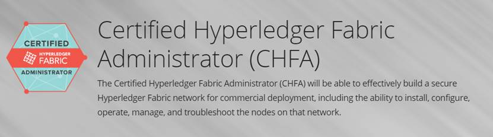

# 课程总结

本课程涉及理论、开发、运维相关知识，学完这个课程大家初步具备了全栈区块链工程师所具备的能力。

你可以根据自己的兴趣，选择以下方向继续深入学习：
## 方案设计

方案设计是设计中的重要阶段，它是一个极富有创造性的设计阶段，同时也是一个十分复杂的问题，它涉及到设计者的知识水平、经验、灵感和想象力等。

方案是一个项目开端，只有方案评审通过，后续的工作才能正常开展，所以方案非常重要。如果你长期从事售前相关工作，可以将重点放在方案设计上。

本教程与方案编写相关的章节如下：

* [区块链技术理论](./chapter1_00.md)
* [Hyperledger Fabric 架构详解](./chapter3_00.md)
   
##  架构设计

架构设计是将客户的需求转换为规范的开发计划及文本，并制定这个项目的总体架构，指导整个开发团队完成这个计划。

架构设计是软件设计过程的早期阶段，它把需求分析和设计流程连接在一起。架构师的主要任务不是从事具体的软件程序的编写，而是从事更高层次的开发构架工作。他必须对开发技术非常了解，并且需要有良好的组织管理能力。可以这样说，一个架构师工作的好坏决定了整个软件开发项目的成败。

本教程与架构设计相关的章节如下：
* [区块链技术理论](./chapter1_00.md)
* [Hyperledger Fabric 架构详解](./chapter3_00.md)
* [区块链溯源案例分析](./chapter6_00.md)
* [区块链即服务](./chapter7_00.md)
* [区块链技术发展趋势](./chapter8_00.md)

## 系统开发
系统开发是根据架构设计实现软件的过程。

本教程与系统开发相关的章节如下：
* [区块链技术理论](./chapter1_00.md)
* [区块链开发实战预备知识](./chapter2_00.md)
* [Hyperledger Fabric 架构详解](./chapter3_00.md)
* [区块链溯源案例分析](./chapter6_00.md)

## 系统运维
系统运维主要是负责Fabric网络搭建、合约部署、应用部署以及后续的升级工作。

本教程与系统运维相关的章节如下：
* [区块链技术理论](./chapter1_00.md)
* [Hyperledger Fabric 架构详解](./chapter3_00.md)
* [Fabric网络搭建详解](./chapter4_00.md)

## 后续学习建议
从学习角度来说，这里推荐大家可以花点时间参加一下官方的[CHFA证书](https://training.linuxfoundation.org/training/hyperledger-fabric-administration-lfs272/)。

 

9-01 CHFA认证

